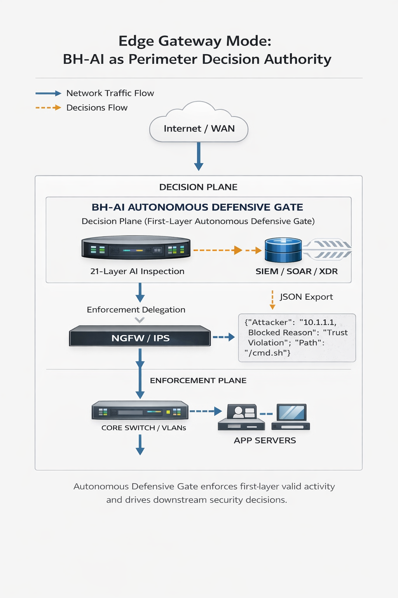
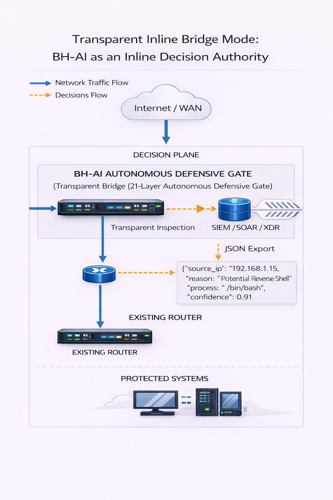
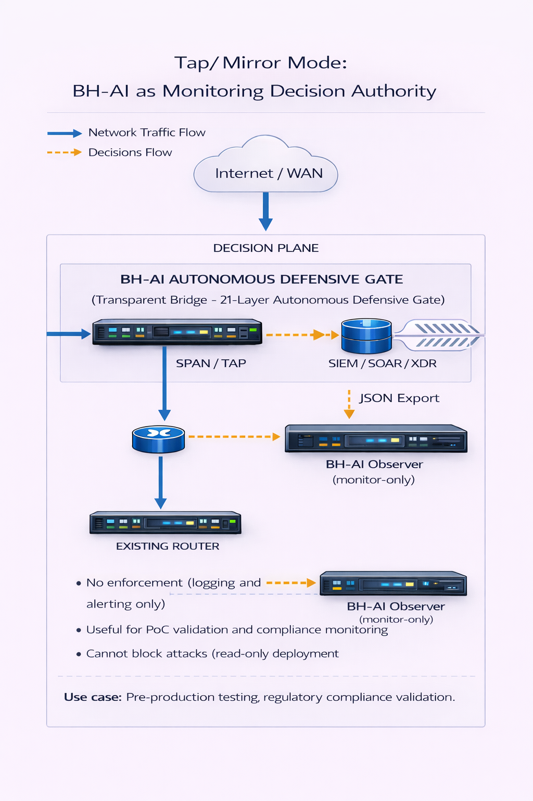
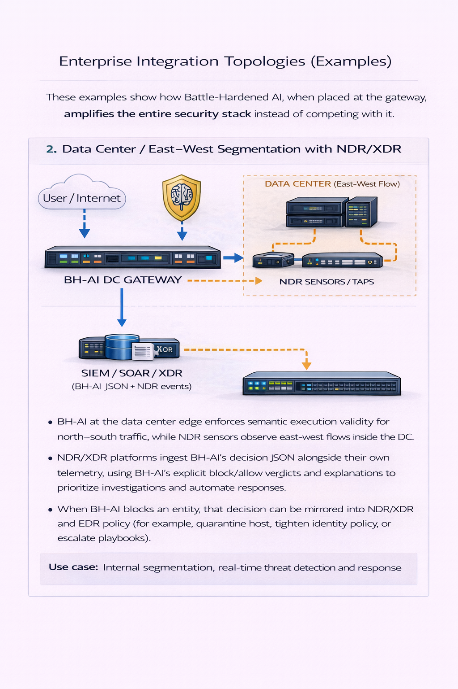
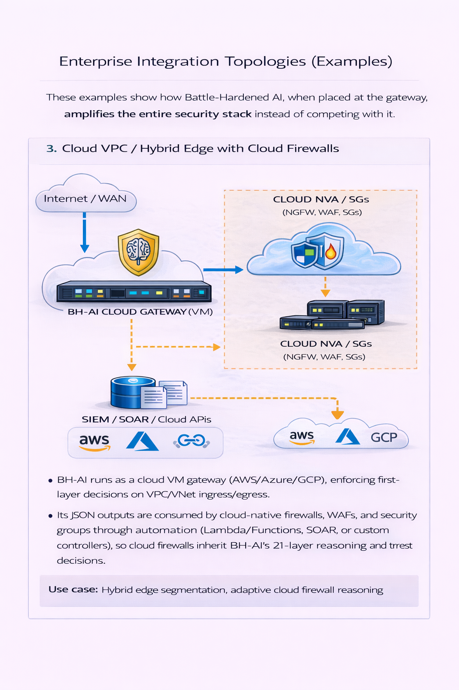
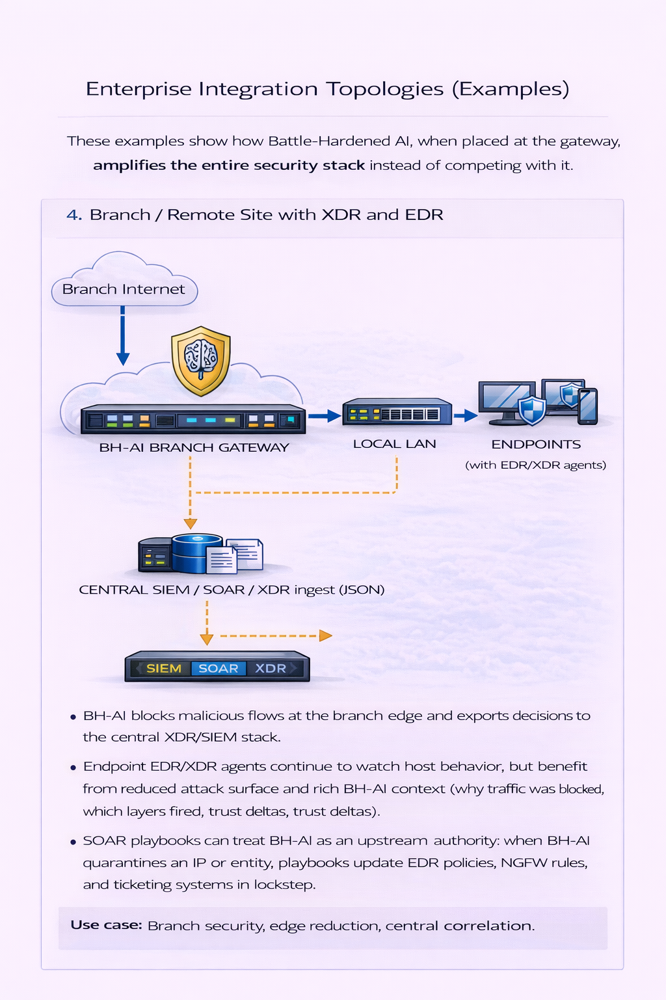
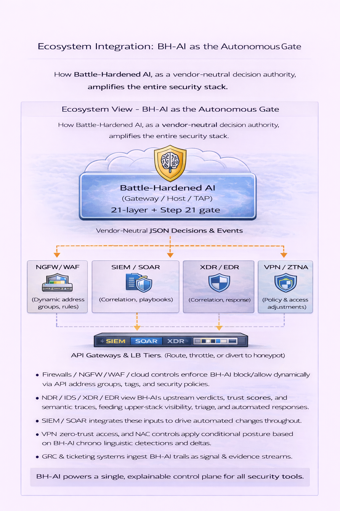

# Battle-Hardened AI
### The Details Here Are ANTI-MARKETING 

This document is written for people who understand first-layer enforcement, gateways, and control planes. It assumes familiarity with firewalls, routing, kernel telemetry, and pre-execution decision systems.

Nothing in Battle-Hardened AI is designed as a marketing gimmick: every term (21 layers, semantic execution-denial, trust graph, causal inference) corresponds to concrete modules, code paths, and enforcement points that can be inspected in this repository and its documentation. For a formal mapping from claims to code and runtime behavior, see [documentation/mapping/Filepurpose.md](documentation/mapping/Filepurpose.md) and [documentation/architecture/Architecture_enhancements.md](documentation/architecture/Architecture_enhancements.md).

---

### 🔑 Summary Highlights

- Blocks malicious actions **before execution** using a 21-layer AI ensemble and a final semantic execution-denial gate.
- Acts as a **first-layer firewall commander** for gateways and routers, deciding what should be blocked while delegating actual enforcement to the local firewall control plane.
- Works **without agents**, exporting neutral JSON that plugs into existing SIEM, SOAR, firewall, and XDR stacks.
- Provides documented coverage for **43 MITRE ATT&CK techniques** via pre-execution denial and trust degradation.
- Built for **enterprise, government, and national-security** defense use cases where autonomy, auditability, and privacy are mandatory.
- Optionally connects to a **central relay/VPS** where many Battle-Hardened AI nodes share only sanitized attack patterns and receive model/signature updates,
  so global learning improves over time without any customer content or PII leaving local infrastructure.
- Implements **5 production-ready ML pipeline hardening features** (see *Architecture Enhancements: ML Pipeline Hardening Layer* below for details).

### Executive Summary (Non-Technical)

- **Stop breaches before they start:** Battle-Hardened AI sits at the gateway and decides what is allowed to execute, blocking malicious activity before it reaches servers, endpoints, or data.
- **Reduce analyst load, not add to it:** It runs autonomously with explainable decisions and conservative defaults, cutting noise instead of generating more alerts.
- **Integrate with what you already have:** Decisions are exported as simple JSON and enforced through existing firewalls, SIEM, SOAR, and EDR/XDR tools—no rip-and-replace.
- **Protect privacy and sovereignty:** Detection happens on your infrastructure, and when the optional relay to the central VPS is enabled, only anonymized
   patterns and statistics are shared—no raw payloads, credentials, or customer data.


Battle-Hardened AI introduces a new category of security: a **first-layer autonomous execution-control system** that operates at the router and gateway boundary, making **pre-execution decisions with full context**—semantic, behavioral, and causal—before any downstream tool is engaged.

We are not aware of any publicly documented enterprise-grade system that:

- Operates as a first-layer gateway authority
- Performs semantic execution validation
- Maintains persistent trust memory
- Uses causal inference to command routers and firewalls prior to execution


---

## Architecture Understanding

### Core Premise: First-Layer Execution-Control Authority

Battle-Hardened AI operates at the **gateway boundary** as the **decision authority**, making pre-execution determinations about what should be blocked or allowed. It does not handle packets directly—instead, it **commands the local OS firewall** (iptables/ipset/nftables on Linux, Windows Defender Firewall on Windows) and exports vendor-neutral JSON that enterprise firewalls, WAFs, and cloud security groups can consume to enforce its decisions.

This architecture creates a clear separation of concerns:
- **Battle-Hardened AI:** Intelligence, analysis, and decision-making
- **OS Firewall:** Enforcement and packet filtering

### Control-Plane Split: Decision vs Enforcement

```
┌──────────────────────────────────────────────────────────┐
│                    DECISION PLANE                        │
│  Battle-Hardened AI (21 detection layers + semantic gate)│
│  - Analyzes traffic via mirror/tap/inline observation    │
│  - Evaluates trust, causality, semantics                 │
│  - Makes block/allow decisions                           │
│  - Emits JSON decisions to enforcement plane             │
└────────────────────┬─────────────────────────────────────┘
                     │ Commands (JSON + firewall API)
                     ↓
┌──────────────────────────────────────────────────────────┐
│                   ENFORCEMENT PLANE                      │
│  OS Firewall / Enterprise Controls                       │
│  (iptables/ipset/nftables, Windows Defender Firewall,    │
│   and external NGFW/WAF/cloud firewalls via JSON)        │
│  - Receive IP/block decisions and policy updates         │
│  - Apply rules at kernel or platform level               │
│  - Drop packets, terminate connections, or adjust paths  │
│  - No analysis—purely enforcement                        │
└──────────────────────────────────────────────────────────┘
```

**This ensures:**
- Battle-Hardened AI cannot be bypassed by routing changes (firewall enforces at kernel)
- Firewall remains auditable and controllable by operators
- Integration with SIEM/SOAR happens via JSON export, not enforcement path

### Deployment Roles

Battle-Hardened AI supports three primary deployment roles (Gateway/Router, Host-only, Observer) that define protection scope and enforcement method. In practice, **Gateway/Router on Linux is the primary enterprise-grade profile**; Host-only is used for appliance-style nodes or critical servers, and Observer is for PoC, compliance, or ultra-sensitive environments where you want detection without inline changes. Windows is supported only for host-only or appliance-style deployments; for full network gateway protection, Linux is required.

For the canonical table, environment mapping, and installation links, see [Deployment Scope — Three Roles, Many Environments](#deployment-scope--three-roles-many-environments) below.

#### Deployment Scope — Three Roles, Many Environments

**Battle-Hardened AI operates in 3 deployment roles:**

| Deployment Role | Protection Scope | Enforcement Method |
|----------------|------------------|-------------------|
| **Gateway/Router** | Entire network segment (all devices behind gateway) | Direct firewall commands (iptables/nftables on Linux) |
| **Host-only** | Single machine + services it terminates | Local firewall (iptables on Linux, Windows Defender Firewall) |
| **Observer** | Detection-only (no direct enforcement) | Exports decisions to external firewall via JSON feeds |

**Installation reference:** For setup by deployment role, see:
- [Installation.md § Deployment Role](documentation/installation/Installation.md#🎯-deployment-role-read-first)
- [Installation.md § Gateway Pre-Flight Checklist](documentation/installation/Installation.md#✅-gateway-pre-flight-checklist)
- [Installation.md § Linux Gateway Setup](documentation/installation/Installation.md#scenario-1-linux-gatewayrouter-network-wide-protection---recommended)
- [Installation.md § Cloud Gateway Setup](documentation/installation/Installation.md#scenario-2-cloud-gateway-with-virtual-nics-awsazuregcp)

**Cloud deployment:** Works identically on cloud VMs (AWS/Azure/GCP) with virtual NICs. Physical hardware not required.

**These 3 roles adapt to different environments:**

- **🏠 Home & Small Office:** Gateway protects entire LAN; host-only protects individual Windows/macOS machines
- **🏢 Enterprise Networks:** Gateway at LAN/VLAN/VPN edge; observer via SPAN/mirror for SOC visibility without routing changes
- **🖥 Servers & Data Centers:** Gateway on reverse proxies/appliance nodes; host-only on critical servers
- **🌐 Websites & APIs:** Gateway in front of web servers/API gateways (works alongside WAFs, not replacing them)
- **☁️ Cloud (IaaS/PaaS):** Gateway with virtual NICs (AWS ENIs, Azure vNICs, GCP interfaces); observer via VPC/VNet flow logs
- **🏭 OT & Critical Infrastructure:** Observer mode for non-intrusive ICS/SCADA/lab monitoring (no agents on sensitive equipment)
- **⚖️ Government & Defense:** Gateway for classified networks with strict data sovereignty (air-gapped relay option available)

#### Enforcement Requires Firewall Integration

To make deny decisions real, Battle-Hardened AI must be connected to the underlying firewall. **Before any production rollout, review [documentation/firewall/Firewall_enforcement.md](documentation/firewall/Firewall_enforcement.md) end-to-end.** On Linux, this typically involves `ipset`/`iptables`; on Windows, it wires into Windows Defender Firewall via PowerShell.

#### Hardware Deployment Checklists

These checklists describe hardware setups for gateway and inline bridge roles. Linux is the primary OS for routing and enforcement. Windows is supported for host-only or appliance-style deployments.

##### ✅ Option A — Battle-Hardened AI as Edge Gateway Router (Recommended for Full Control)

**Required Hardware**

- Modem/ONT in bridge mode (disables NAT and firewall)
- Dedicated Linux appliance (2 NICs: WAN + LAN)
- Intel-class NICs (for example, i210/i350)
- AES-NI capable CPU
- 16–32 GB RAM
- SSD/NVMe storage
- Layer-2 switch (VLAN-capable preferred)
- Wi‑Fi AP in bridge mode (no DHCP/NAT)

**What This Delivers**

- Battle-Hardened AI becomes the default gateway
- All traffic flows through Battle-Hardened AI (no bypass without physical change)
- Full control over NAT, routing, firewall, and semantic validation
  
**Topology Mapping:** This hardware profile implements the **Router Mode (Production Default)** topology described in the *Topologies* section below.

##### ✅ Option B — Battle-Hardened AI as Transparent Inline Bridge (No Routing Changes)

**Required Hardware**

- Modem/ONT in bridge mode
- Battle-Hardened AI Linux node with 2 NICs (WAN-side + LAN-side)
- Existing router handling NAT, DHCP, and Wi‑Fi

**What This Delivers**

- No router reconfiguration needed
- Battle-Hardened AI still sees and filters traffic before router interaction
- Minimal architectural disruption

**Topology Mapping:** This hardware profile implements the **Transparent Bridge Mode** topology described in the *Topologies* section below.

#### ⚠️ What You Don’t Need

- ❌ SD-WAN or cloud-managed routers
- ❌ Proprietary routers or expensive chassis
- ❌ Agents on endpoints
- ❌ Cloud connectivity for core detection

### Topologies

#### Router Mode (Production Default)

Battle-Hardened AI VM acts as the **default gateway** for protected systems:

```
Internet ──→ BH-AI Gateway ──→ Protected Systems
              (Decision +         (receive only
              Enforcement)         pre-approved traffic)
```


- Protected systems route all traffic through BH-AI
- BH-AI inspects traffic and commands firewall
- Attackers blocked before reaching protected services

**Setup:** See [Installation.md](documentation/installation/Installation.md) Gateway/Router Mode section.

#### Transparent Bridge Mode (Planned)

BH-AI operates inline **without becoming the default gateway**:

```
Internet ──→ BH-AI Bridge ──→ Router ──→ Protected Systems
              (transparent        (existing gateway)
               inspection)
```


- No routing changes required
- BH-AI inspects traffic via bridge interface
- Commands firewall on bridge to drop malicious packets

**Status:** Coming soon. See [Installation.md](documentation/installation/Installation.md) for updates.

#### Tap/Mirror Mode (Observer Only)

BH-AI receives copy of traffic via **SPAN port or network TAP**:

```
Internet ──→ Router ──→ Protected Systems
               │
               └──→ SPAN/TAP ──→ BH-AI Observer
                                  (monitor-only)
```


- No enforcement (logging and alerting only)
- Useful for PoC validation and compliance monitoring
- Cannot block attacks (read-only deployment)

**Use case:** Pre-production testing, regulatory compliance validation.

#### Enterprise Integration Topologies (Examples)

These examples show how Battle-Hardened AI, when placed at the gateway, **amplifies the entire security stack** instead of competing with it.

**1. Edge Gateway in Front of NGFW / IPS**

```
Internet ──→ BH-AI Gateway ──→ NGFW / IPS ──→ Core Switch / VLANs ──→ Servers & Users
              (Semantic           (Deep packet /               
              execution gate)      compliance inspection)
```


- BH-AI makes first-layer, semantic allow/deny decisions and blocks clearly malicious flows before they ever hit the NGFW/IPS.
- The NGFW/IPS sees **fewer, higher-quality events**, focusing on deep content/compliance rather than obvious brute-force, scanning, or reputation-abuse traffic.
- BH-AI JSON feeds (threat_log.json, blocked_ips.json) can drive NGFW address groups and IPS policies via SIEM/SOAR, turning traditional firewalls into a high-speed enforcement plane for BH-AI decisions.

**2. Data Center / East–West Segmentation with NDR/XDR**

```
User / Internet ──→ BH-AI DC Gateway ──→ App / DB Tiers
                          │                    │
                          │                    └──→ NDR sensors / taps
                          └──→ SIEM / SOAR / XDR (BH-AI JSON + NDR events)
```


- BH-AI at the data center edge enforces semantic execution validity for north–south traffic, while NDR sensors observe east–west flows inside the DC.
- NDR/XDR platforms ingest BH-AI’s decision JSON alongside their own telemetry, using BH-AI’s **explicit block/allow verdicts and explanations** to prioritize investigations and automate responses.
- When BH-AI blocks an entity, that decision can be mirrored into NDR/XDR and EDR policy (for example, quarantine host, tighten identity policy, or escalate playbooks).

**3. Cloud VPC / Hybrid Edge with Cloud Firewalls**

```
Internet / WAN ──→ BH-AI Cloud Gateway (VM) ──→ Cloud NVA / SGs ──→ Workloads
                         │                         (NGFW, WAF, SGs)
                         └──→ SIEM/SOAR / Cloud APIs
```


- BH-AI runs as a cloud VM gateway (AWS/Azure/GCP), enforcing first-layer decisions on VPC/VNet ingress/egress.
- Its JSON outputs are consumed by cloud-native firewalls, WAFs, and security groups through automation (Lambda/Functions, SOAR, or custom controllers), so **cloud firewalls inherit BH-AI’s 21-layer reasoning and trust decisions**.

**4. Branch / Remote Site with XDR and EDR**

```
Branch Internet ──→ BH-AI Branch Gateway ──→ Local LAN ──→ Endpoints (with EDR/XDR agents)
                                  │
                                  └──→ Central SIEM / SOAR / XDR ingest (JSON)
```


- BH-AI blocks malicious flows at the branch edge and exports decisions to the central XDR/SIEM stack.
- Endpoint EDR/XDR agents continue to watch host behavior, but benefit from **reduced attack surface and rich BH-AI context** (why traffic was blocked, which layers fired, trust deltas).
- SOAR playbooks can treat BH-AI as an upstream authority: when BH-AI quarantines an IP or entity, playbooks update EDR policies, NGFW rules, and ticketing systems in lockstep.

**Ecosystem View — BH-AI as the Autonomous Gate**

At a high level, BH-AI sits at the execution gate and exports **vendor-neutral JSON decisions** that other systems consume:

```text
          Internet / WAN / Users
                   │
                   ▼
        ┌────────────────────────────┐
        │      Battle-Hardened AI    │
        │   (Gateway / Host / TAP)   │
        │  21-layer + Step 21 gate   │
        └───────────┬────────────────┘
            OS firewall enforcement
 (iptables/ipset/nftables, Windows Firewall)
                    │
        JSON decisions & events (export)
   ┌─────────────┼─────────────┬──────────────┬───────────────┐
   ▼             ▼             ▼              ▼
NGFW/WAF &   SIEM / SOAR   XDR / EDR     VPN / ZTNA / NAC
cloud firewalls (dynamic  (correlation,  (policy & access   
address groups, rules)    playbooks)      adjustments)
   ┌─────────────┴─────────────┬──────────────┬───────────────┐
   ▼                           ▼              ▼
API gateways & LB        GRC / audit &   ITSM / ticketing /
tiers (route, throttle,  compliance tools  runbooks (cases,
or send to honeypot)     (evidence,        approvals, change
                          control mapping)  tracking)
```


In enterprise deployments this means:

- **Firewalls / NGFW / WAF / cloud controls** enforce BH-AI block/allow decisions via dynamic address groups, tags, and policies.
- **NDR / IDS / XDR / EDR** gain an upstream semantic verdict and trust score for each entity, improving triage, correlation, and automated containment.
- **SIEM / SOAR** orchestrate changes across all these planes using BH-AI’s explainable JSON events as the trigger and ground truth.
- **VPN, Zero-Trust access, and NAC** can tighten or relax access based on BH-AI trust deltas and recent semantic violations.
- **API gateways, load balancers, and reverse proxies** can route, throttle, or divert suspicious flows (for example to honeypots) based on BH-AI output.
- **GRC, audit, and ticketing systems** consume BH-AI’s audit trails and decisions as evidence and as automatic case-open/close signals.

Taken together, these patterns highlight the intended positioning: **Battle-Hardened AI is an autonomous defensive gate that drives firewalls, IDS/IPS, NDR, XDR, cloud controls, identity and access systems, and operational tooling via a single, explainable decision plane.**

### Federated Relay Architecture

When the **optional relay** is enabled, Battle-Hardened AI nodes share intelligence globally while preserving privacy:

- Customer nodes upload **sanitized patterns and statistics only** (no payloads, credentials, or PII).
- Relay distributes **models, signatures, and reputation feeds only** (no raw training data from customers).
- Model signing, Byzantine validation, and ONNX optimization harden distribution against tampering and performance regressions.

For the full Stage 5–7 technical flow and privacy guarantees, see [AI instructions](documentation/architecture/Ai-instructions.md) (Stages 5–7 implementation details) and [Attack handling flow](documentation/architecture/Attack_handling_flow.md) (end-to-end relay and response behavior).

### Architecture Enhancements: ML Pipeline Hardening Layer

Beyond the 21 detection layers, Battle-Hardened AI implements **5 production security features** that harden the ML training pipeline against supply chain attacks, performance degradation, and adversarial manipulation:

| Enhancement | Security Benefit | Performance Benefit | MITRE Defense |
|-------------|------------------|---------------------|---------------|
| **#1: Model Cryptographic Signing** | Prevents model injection | <1ms overhead | T1574.012 (Supply Chain) |
| **#2: Smart Pattern Filtering** | Reduces attack surface | 70-80% bandwidth savings | N/A (Operational) |
| **#3: Model Performance Monitoring** | Detects model poisoning | ~5% overhead | T1565.001 (Data Manipulation) |
| **#4: Adversarial Training** | ML evasion resistance | Training +30% (relay-side only) | T1562.004 (Impair Defenses) |
| **#5: ONNX Model Format** | Faster threat response | **2-5x faster inference** | N/A (Performance) |

**Key capabilities:**
- Ed25519 cryptographic signatures verify every model before loading
- Bloom filters deduplicate attack patterns (76% bandwidth reduction in production)
- Production accuracy tracking triggers auto-retraining if model degrades
- FGSM adversarial training makes models robust against ML evasion attacks
- ONNX Runtime provides 2-5x faster CPU inference (no GPU required)

**For detailed technical documentation:**
- [Architecture_enhancements.md](documentation/architecture/Architecture_enhancements.md) - Complete implementation guide
- [ONNX_integration.md](documentation/architecture/ONNX_integration.md) - ONNX deployment and benchmarks

### Operational Loop: Continuous Defense Improvement

Battle-Hardened AI runs in a **closed loop** so defenses continuously adapt to new behavior:

1. **Detect** – 21 layers analyze traffic (signatures, ML, behavioral, trust, causal).
2. **Decide** – Ensemble voting + semantic gate + trust modulation produce allow/deny.
3. **Enforce** – OS firewalls apply blocks/TTL; connections are dropped or rate-limited.
4. **Log & Export** – Decisions written to JSON (threat_log.json, blocked_ips.json, audit) and streamed to the dashboard and (optionally) SIEM/SOAR.
5. **Learn & Measure** – Extract sanitized patterns, update reputation, monitor model performance, and validate integrity.
6. **Update** – Merge new signatures, refresh models, and adjust baselines, then loop back to Detect with stronger defenses.

Feedback operates on multiple time scales (real-time reputation and firewall updates; hourly signature extraction; 6‑hour model pulls from relay; weekly retraining; monthly drift refresh; emergency retraining when accuracy drops), all while keeping raw payloads and customer data local.

For the full Stage 7 implementation and timing details, see the deep-dive architecture docs: [AI instructions](documentation/architecture/Ai-instructions.md), [Architecture_enhancements.md](documentation/architecture/Architecture_enhancements.md), and [Attack handling flow](documentation/architecture/Attack_handling_flow.md).

---

## What Does Battle-Hardened AI Do?

*Visual Attack Detection & Response Flow*

```
📥 PACKET ARRIVES
    ↓
📊 Pre-processing (metadata extraction, normalization)
    ↓
⚡ 20 PARALLEL DETECTIONS (Primary Signals 1-18 + Strategic Intelligence 19-20)
    ├─ Kernel Telemetry (eBPF/XDP syscall correlation)
    ├─ Signatures (3,066+ attack patterns)
    ├─ RandomForest ML (supervised classification)
    ├─ IsolationForest ML (unsupervised anomaly detection)
    ├─ GradientBoosting ML (reputation modeling)
    ├─ Behavioral (15 metrics + APT: low-and-slow, off-hours, credential reuse)
    ├─ LSTM Sequences (6 attack states + APT campaign patterns)
    ├─ Autoencoder (zero-day via reconstruction error)
    ├─ Drift Detection (model degradation monitoring)
    ├─ Graph Intelligence (lateral movement, C2, hop chains)
    ├─ VPN/Tor Fingerprint (de-anonymization)
    ├─ Threat Intel (VirusTotal, AbuseIPDB, ExploitDB, etc.)
    ├─ False Positive Filter (5-gate consensus validation)
   ├─ Historical Reputation (cross-session recidivism ~94%, internal lab evaluation; see "Validation & Testing" below)
    ├─ Explainability Engine (human-readable decisions)
    ├─ Predictive Modeling (24-48h threat forecasting)
    ├─ Byzantine Defense (poisoned update rejection)
    ├─ Integrity Monitoring (tampering detection)
    ├─ 🧠 Causal Inference Engine (root cause: why did this happen?)
    └─ 🔐 Trust Degradation Graph (zero-trust: entity trust scoring 0-100)
   ↓
🎯 ENSEMBLE VOTING (weighted consensus + causal adjustment + trust modulation)
    ├─ Calculate weighted score (0.65-0.98 per signal)
    ├─ Apply authoritative boosting (honeypot, threat intel override)
    ├─ Causal inference adjustment (downgrade if legitimate, boost if malicious)
    ├─ Trust state modulation (stricter thresholds if trust <40, quarantine if <20)
    ├─ Check consensus strength (unanimous / strong / divided)
   └─ Decision: Block (≥75%) / Log (≥50%) / Allow (<50%)
   │   └─ APT Mode: Block threshold lowered to ≥70%
   │   └─ Low Trust (<40): Block threshold lowered to ≥60%
   ↓
🧩 STEP 21: SEMANTIC EXECUTION-DENIAL GATE
   ├─ Evaluate state legitimacy (lifecycle, sequence, authentication)
   ├─ Evaluate intent legitimacy (role vs requested action)
   ├─ Validate structural legitimacy (payload/schema/encoding safety)
   ├─ Check trust sufficiency (trust_graph thresholds per entity; thresholds are customizable per organization policy)
   ├─ If SEMANTICALLY_INVALID → deny execution meaning (no state change, no backend call)
   └─ If SEMANTICALLY_VALID → proceed to response execution
   ↓
🛡️ RESPONSE EXECUTION (policy-governed)
    ├─ Firewall block (iptables/nftables + TTL)
    ├─ Connection drop (active session termination)
    ├─ Rate limiting (if 50-74% confidence)
    ├─ Local logging → threat_log.json (rotates at 100MB) + 10+ audit surfaces
    ├─ Dashboard update (real-time WebSocket push)
   └─ Alerts (SIEM integration; email/SMS only for critical SYSTEM events like kill-switch/integrity violations)
    ↓
🧬 TRAINING MATERIAL EXTRACTION (privacy-preserving, customer-side)
   ├─ Extract to local staging: honeypot_patterns.json under the JSON directory returned by AI.path_helper.get_json_dir()
    ├─ Signatures (patterns only, zero exploit code)
    ├─ Statistics (anonymized: connection rate, port entropy, fan-out)
   ├─ Reputation (SHA-256 hashed IPs → reputation.db, not raw addresses)
    ├─ Graph patterns (topology labels A→B→C → network_graph.json)
    └─ Model weight deltas (RandomForest/LSTM/Autoencoder adjustments)
    ↓
🌍 RELAY SHARING (optional, authenticated)
    ├─ Push: Local findings → Relay Server (every hour)
    ├─ Pull: Global intel ← Relay Server (every 6 hours)
   │   ├─ 3,000+ new signatures from worldwide nodes *(lab-measured, relay training corpus)*
    │   ├─ Known bad IP/ASN reputation feed
    │   ├─ Model updates (Byzantine-validated)
    │   └─ Emerging threat statistics (CVEs, attack trends)
    └─ Merge: Integrate global knowledge into local detection
    ↓
🔄 CONTINUOUS LEARNING (feedback-driven improvement)
   ├─ Signature database auto-updated (hourly)
   ├─ ML models retrained (weekly with labeled data)
   ├─ Reputation tracker updated (with decay, half-life 30 days)
   ├─ Drift baseline refreshed (monthly adaptation)
   └─ Byzantine validation (94% malicious update rejection, measured on adversarial lab simulations; see "Validation & Testing" below)
   ↓
🔁 LOOP: Next packet processed with improved defenses

🔒 ARCHITECTURE ENHANCEMENTS — see *Architecture Enhancements: ML Pipeline Hardening Layer* above for the five production security features (model signing, pattern filtering, performance monitoring, adversarial training, ONNX).
```

Implementation-wise, customer nodes:
- Push sanitized threat summaries and extracted patterns to a centrally-operated relay/VPS over WebSocket (typically `wss://<relay-host>:60001`) using a dedicated relay client.
- Pull **only pre-trained models** and curated signature/reputation/intel bundles from an HTTPS training API (typically `https://<relay-host>:60002`); raw training datasets and history remain on the relay and never transit customer networks.
- Load downloaded models from their local ML models directory (resolved by `AI.path_helper.get_ml_models_dir()`); nodes never read `relay/ai_training_materials/` directly.

This relay pattern creates a federated, privacy-preserving defense mesh; see the *Federated Relay Architecture* and *Data Handling & Privacy Principles* sections for the full privacy and control guarantees.

---

In the standard shipping profiles:

- The **Linux gateway container** and the **Windows EXE** both include the persistent reputation tracker by default (backed by `reputation.db` under the JSON directory), so repeat offenders and long-lived bad actors are remembered across sessions.
- Core OSINT threat crawlers (hash/URL/score–only feeds such as MalwareBazaar, URLhaus, and CVE scores) are enabled by default and feed the threat intelligence and DNS/geo sections, while heavier text-based feeds remain optional and operator-controlled.
- Advanced TensorFlow-based autoencoder and sequence models are available as an optional, environment-specific profile for customers that explicitly want the full ML stack and are prepared for the larger footprint.

### Semantic Enforcement Model

*How Battle-Hardened AI decides which requests are allowed to execute or blocked before they reach downstream systems.*

Unlike traditional tools that detect attacks **after** execution, Battle-Hardened AI enforces **semantic execution validity** using 21 independent detection and reasoning layers. These layers incorporate:

- Kernel-level telemetry
- Behavioral and statistical intelligence
- Graph analysis
- Causal inference
- Persistent trust memory

This ensemble determines when trust, structure, or semantics are invalid, and can autonomously instruct routers and firewalls to block execution **before harm occurs**.

- **Semantic execution validity:** Verifies that a request both makes sense and is safe *before* it is allowed to run.
- **Causal inference:** Determines the root reason an action occurred, helping identify intent and trustworthiness.

> Attacks are observed, understood, and remembered—yet denied at origin.

### Not an Incremental Add-On

Battle-Hardened AI is a **stateful, pre-execution control class**—a first-layer decision system that:

- Resists probing and iterative evasion
- Degrades adversary trust over time
- Prevents coercion by malicious inputs
- Covers 43 MITRE ATT&CK techniques
- Operates independently of alert volume or SIEM bloat

For a detailed comparison with NDR/XDR platforms and traditional tools, including scoring examples and vendor landscape, see [Competitive Positioning vs NDR/XDR Platforms](#competitive-positioning-vs-ndrxdr-platforms).

### What Makes Us Different

Battle-Hardened AI is not "better analytics on the same events"—it is a **first-layer semantic execution-control system** that decides if interactions are allowed to exist at all, then drives existing firewalls and security tools with those decisions. For detailed vendor and platform comparison, including timing and stack placement, see [Competitive Positioning vs NDR/XDR Platforms](#competitive-positioning-vs-ndrxdr-platforms).

### 🧪 Example: SSH Credential Stuffing

- **Traditional flow:** Attackers perform high-volume or distributed SSH login attempts. Sessions are established, and only then do downstream tools detect anomalies and raise alerts.
- **With Battle-Hardened AI:** Behavioral, sequence, and trust signals flag abnormal SSH login patterns. Trust for the source degrades, and the semantic execution-denial gate determines that the login attempts are not legitimate for the entity.
- **Outcome:** Connections are blocked **before** successful session establishment, and the attacker cannot meaningfully interact with protected systems.

#### Data Handling & Privacy Principles

Battle-Hardened AI follows strict data-handling principles at the first layer:

- Observes all traffic, retains only patterns
- Validates structure and semantics, not full payloads
- Makes allow/deny decisions, but does not investigate
- Maintains trust models without exposing raw content externally

### Enterprise Integration Outputs (JSON Feeds)

As an autonomous defensive gate, Battle-Hardened AI emits **vendor-neutral JSON decision feeds** that downstream systems consume. Example:

```json
{
  "blocked_ips": [
    {
      "ip": "203.0.113.10",
      "timestamp": "2026-01-20T17:51:38.361466+00:00",
      "reason": "Threat detection by AI engine"
    }
  ]
}
```

The JSON format is **identical across Linux (Docker) and Windows**. For how these decisions drive NGFW/WAF, NDR/XDR, SIEM/SOAR, VPN/ZTNA, GRC, and ITSM tooling, see the **Ecosystem View — BH-AI as the Autonomous Gate** diagram in the Topologies section above.

No vendor-specific code is baked into the core. Adapters or SOAR playbooks watch these JSON feeds and translate them into platform-specific API calls.

#### Where to Configure BH Outputs

- **SIEM/SOAR**: Create a data source to ingest Battle-Hardened AI JSON; trigger enforcement via playbooks or rules.
- **NGFW/WAF**: Use your automation layer (SOAR, scripts, or connectors) to call vendor APIs when Battle-Hardened AI outputs change.
- **EDR/XDR**: Integrate with vendor APIs through SOAR or connector scripts to apply block/allow decisions to endpoints.

You never modify Battle-Hardened AI code—you wire your tools to the Battle-Hardened AI feed.

### Quick Start: From Install to Enforcement

For full, step-by-step instructions, see [Installation.md](documentation/installation/Installation.md). In practice, most deployments follow this minimal path:

- **Install & bring up services:** Follow [Installation.md](documentation/installation/Installation.md) for your platform (Linux gateway, Windows host-only, or observer).
- **Verify telemetry & decisions:** Open the dashboard described in [Dashboard](documentation/mapping/Dashboard.md) to confirm live traffic, decisions, and governance surfaces.
- **Wire the firewall:** Apply the OS firewall integration from [Firewall_enforcement.md](documentation/firewall/Firewall_enforcement.md) so decisions in `blocked_ips.json` and related JSON surfaces are enforced on iptables/ipset (Linux) or Windows Defender Firewall.
- **Integrate with SIEM/SOAR and workflows:** Use the JSON surfaces referenced in [Dashboard](documentation/mapping/Dashboard.md) and the end-to-end behavior in [Attack handling flow](documentation/architecture/Attack_handling_flow.md) to stream decisions into your SIEM/SOAR and playbooks.
- **Validate end-to-end:** Run controlled attack scenarios from [KALI_ATTACK_TESTS.md](KALI_ATTACK_TESTS.md) to verify detection, blocking, logging, and integration paths before broad rollout.

### What Battle-Hardened AI Offers (Capabilities & Roadmap)

These capabilities span **current, implemented features** and **roadmap items**. Use this checklist together with the implementation-status table below to understand what works today versus what is planned.

#### Current Capabilities (v1.0)

- 21-layer detection and reasoning pipeline (20 signals + Step 21 semantic gate) wired into the main gateway request path.
- Linux and Windows deployments with local firewall enforcement via iptables/ipset (Linux) and Windows Defender Firewall (Windows).
- Real-time dashboard with 24 core sections, governance/killswitch controls, and decision explainability for autonomous blocks/allows.
- Optional relay/VPS for federated, pattern-only threat sharing and model/signature distribution (no raw payloads or customer data).
- JSON-based integration surfaces for SIEM/SOAR/firewalls (threat_log.json, blocked_ips.json, network_graph.json, trust_graph.json, and relay feeds).

#### Roadmap (Future Enhancements)

- Additional cloud provider coverage and deeper cloud posture management.
- Expanded enterprise integration presets and sample configurations for common SIEM/firewall platforms.
- More formal external validation (third-party tests, red-team exercises, and production case studies).
- Progressive UI and documentation improvements for operators (troubleshooting, runbooks, and deployment blueprints).

#### Current Dashboard Sections (24 core sections)

The dashboard exposes 24 core sections that map directly to JSON surfaces and subsystems; full, field-level descriptions live in [Dashboard](documentation/mapping/Dashboard.md). This README lists them for orientation:

- 1 — AI Training Network – Shared Machine Learning
- 2 — Network Devices – Live Monitor, Ports & History
- 3 — Attackers VPN/Tor De-Anonymization Statistics
- 4 — Real AI/ML Models – Machine Learning Intelligence
- 5 — Security Overview – Live Statistics
- 6 — Threat Analysis by Type
- 7 — IP Management & Threat Monitoring
- 8 — Failed Login Attempts (Battle-Hardened AI Server)
- 9 — Attack Type Breakdown (View)
- 10 — Automated Signature Extraction – Attack Pattern Analysis
- 11 — System Health & Network Performance
- 12 — Audit Evidence & Compliance Mapping
- 13 — Attack Chain Visualization (Phase 4 - Graph Intelligence)
- 14 — Decision Explainability Engine (Phase 7 - Transparency)
- 15 — Adaptive Honeypot - AI Training Sandbox
- 16 — AI Security Crawlers & Threat Intelligence Sources
- 17 — Traffic Analysis & Inspection
- 18 — DNS & Geo Security
- 19 — User & Identity Trust Signals
- 20 — Sandbox Detonation
- 21 — Email/SMS Alerts (Critical Only)
- 22 — Cryptocurrency Mining Detection
- 23 — Governance & Emergency Controls
- 24 — Enterprise Security Integrations

The **Enterprise Security Integrations** section (24) is planned to configure outbound adapters that stream first‑layer decisions into SIEM, SOAR, and IT‑operations platforms. This integrations plane will be export‑only; primary blocking remains on the local firewall enforcement path. Note: The section title in technical documentation may include "(Outbound)" for clarity, but the dashboard displays it as "Enterprise Security Integrations".

**Status:** Roadmap feature. Currently, operators must manually consume `threat_log.json` and `blocked_ips.json` via custom scripts or SOAR connectors.

##### Example: Planned `enterprise_integration.json` Structure

When implemented, Battle-Hardened AI will resolve an `enterprise_integration.json` file from its JSON configuration directory (see `AI/path_helper.py` and `documentation/mapping/Dashboard.md` for directory details). The planned structure looks like this:

```json
{
   "syslog_targets": [
      {
         "name": "primary-siem",
         "host": "10.0.10.5",
         "port": 514,
         "protocol": "udp",
         "format": "cef",
         "enabled": true
      }
   ],
   "webhook_targets": [
      {
         "name": "soar-playbook-ingest",
         "url": "https://soar.example.com/hooks/bh-ai-events",
         "method": "POST",
         "verify_tls": true,
         "enabled": true
      }
   ]
}
```

In this planned configuration, first-layer decisions (blocks/allows plus reasons) would be streamed as summarized events to the SIEM and SOAR endpoints. Raw packet payloads and full PCAPs remain local to the Battle-Hardened AI node; only structured metadata and verdicts are exported.

**Implementation note:** Until this feature is implemented, use SOAR connectors or scripts to watch `threat_log.json` and `blocked_ips.json` directly and call your SIEM/SOAR/NGFW vendor APIs.

#### Implementation Status at a Glance

This table summarizes major capability areas, where they live in the repository, and whether they are fully implemented or still evolving.

| Capability Area | Representative Modules / Paths | Status | Notes |
|-----------------|--------------------------------|--------|-------|
| Kernel telemetry & packet capture | `AI/kernel_telemetry.py`, `AI/pcap_capture.py` | Implemented | eBPF/syscall visibility and packet capture used in core detection layers. |
| Ensemble scoring & meta-decision engine | `AI/meta_decision_engine.py`, `AI/pcs_ai.py` | Implemented | Weighted voting, boosting, and decision export to JSON/firewall. |
| Causal inference & trust graph | `AI/causal_inference.py`, `AI/trust_graph.py` | Implemented (initial) | Produces root-cause and long-term trust signals (Layers 19 & 20). |
| Federated relay & training sync | `relay/relay_server.py`, `relay/training_sync_api.py`, `AI/training_sync_client.py`, `AI/byzantine_federated_learning.py` | Implemented (early access) | Optional; supports sanitized sharing and **models-only** updates with Byzantine validation (no raw training data leaves the relay). |
| Cloud security & API ingestion | `AI/cloud_security.py` | Partial / roadmap | Initial support present; broader provider coverage and runbooks will expand over time. |
| Step 21 semantic gate & policy governance | `AI/step21_semantic_gate.py`, `AI/policy_governance.py` | Implemented; refinement planned | Core semantic gate is active; additional policy bundles and hardening are listed under "Future Enhancements". |
| Compliance reporting & governance | `AI/compliance_reporting.py`, `AI/policy_governance.py` | Partial / roadmap | Baseline evidence surfaces exist; deeper framework mappings will grow with customer usage. |

#### Example: End-to-End Block Flow (Attack → Decision → Firewall)

The typical flow for a network attack looks like this:

1. **Packet observed** – Traffic hits the protected interface; kernel telemetry and packet capture modules record the flow.
2. **21-layer evaluation** – `AI/pcs_ai.py` orchestrates the detection pipeline (20 signals + Step 21 semantic gate) and produces a `SecurityAssessment` with `should_block`, `threat_level`, and `threats`.
3. **Decision export** – The assessment is written to JSON surfaces such as `threat_log.json` and `blocked_ips.json` in the configured JSON directory.
4. **Firewall sync** – On Windows, the `packaging/windows/windows-firewall/configure_bh_windows_firewall.ps1` script (installed as `{app}/windows-firewall/configure_bh_windows_firewall.ps1` and typically invoked by Task Scheduler with `-SkipBaselineRules` and an explicit `-JsonPath`) reads `blocked_ips.json` and updates the "Battle-Hardened AI Blocked IPs" rule. On Linux, iptables/ipset are updated via the server’s enforcement layer.
5. **Operator view** – The dashboard surfaces the same decision and context in Sections 5 (Security Overview), 7 (IP Management), 14 (Decision Explainability), and 23 (Governance & Emergency Controls).

This model keeps enforcement local to the OS firewalls, with the AI engine responsible for making high-quality, explainable allow/block decisions and exporting them in a machine-consumable form.

Firewall enforcement paths (Linux vs Windows EXE):

```text
    ┌─────────────────────────────┐
    │  Battle-Hardened AI Engine │
    │  (AI/ + server/)           │
    └────────────┬────────────────┘
         │
         │ JSON decisions
         ▼
    ┌─────────────────────────────┐
    │  blocked_ips.json,         │
    │  threat_log.json, etc.    │
    └────────────┬────────────────┘
         │
     ┌───────────────┴─────────────────────────────┐
     │                                             │
     ▼                                             ▼
┌───────────────┐                        ┌────────────────────────────┐
│ Linux Gateway │                        │ Windows EXE Installation   │
│  (Docker/bare │                        │  {app}\BattleHardenedAI.exe│
│   metal)      │                        │  {app}\.env.windows        │
└──────┬────────┘                        └──────────────┬─────────────┘
   │ iptables/ipset updates                        │ Task Scheduler
   ▼                                               ▼ (JSON path → script)
┌───────────────┐                        ┌────────────────────────────┐
│ OS Firewall   │                        │ {app}\windows-firewall\    │
│ (iptables/    │                        │ configure_bh_windows_      │
│  nftables)    │                        │ firewall.ps1               │
└──────┬────────┘                        └──────────────┬─────────────┘
   │                                                   │
   ▼                                                   ▼
   Enforced traffic (blocks, TTL)                 Windows Defender Firewall
```

#### Troubleshooting & Operational Scenarios (Quick Reference)

- **Step 21 seems too aggressive (false positives):** Use the Governance & Emergency Controls section (23) to move from fully autonomous deny into observe or approval modes, then adjust the Step 21 policy bundle under `policies/step21` (for example, HTTP method and trust-threshold settings) and reload. For detailed guidance, see `documentation/architecture/Architecture_enhancements.md` and `documentation/architecture/Attack_handling_flow.md`.
- **Relay/central training status is unhealthy:** Check Section 1 on the dashboard and the `/api/relay/status` endpoint for detailed error messages (DNS, TLS, authentication). Verify relay settings in the environment or in the installed `.env.windows` file next to `BattleHardenedAI.exe` (for EXE deployments), and ensure outbound firewall rules permit the configured relay URL/port.
- **Blocked IPs are not reflected in Windows Firewall:** Confirm that `blocked_ips.json` is being updated in the runtime JSON directory (for EXE builds this is under `%LOCALAPPDATA%/Battle-Hardened AI/server/json`), and that Task Scheduler is invoking `{app}/windows-firewall/configure_bh_windows_firewall.ps1` with `-SkipBaselineRules` and the correct `-JsonPath`. See `documentation/firewall/Firewall_enforcement.md` for examples.
- **Dashboard shows data but enforcement appears inactive:** On Linux, verify iptables/ipset rules were created and are still present; on Windows, inspect the "Battle-Hardened AI Blocked IPs" rule and ensure no third-party software has overridden it. In both cases, check the watchdog/service status and the Security Overview (Section 5) for recent block events.
- **General startup and health issues:** Follow the `documentation/installation/Installation.md` checklist, paying special attention to permissions, NIC binding, and JSON directory configuration. The System Health & Network Performance section (11) is the primary runtime surface for spotting resource and integrity problems.

### What Does Not Exist (Breakthrough)

To the best of our knowledge from publicly available vendor and research materials, no documented unified implementation—commercial or open—covers all of the following as a single architecture:

- Observe attacks end-to-end, across network, application, and behavioral layers
- Learn continuously from real adversary behavior
- Preserve raw attack intelligence in structured, privacy-respecting form
- Maintain long-lived trust memory that cannot be trivially reset
- Enforce protocol and execution semantic validity
- Deny execution meaning before attacker impact
- Apply these controls uniformly across environments
- Treat semantic invalidity as a first-class defensive signal

This is not a feature gap — **it is a paradigm gap**.

While isolated forms of semantic validation exist in narrow domains, to our knowledge no NDR or XDR platform implements system-wide semantic execution denial integrated with learning, trust memory, and causal reasoning. Battle-Hardened AI closes that gap by design.

### Normative References (Source-of-Truth Documents)

For auditors, engineers, and operators, the following documents serve as the authoritative technical references for this system:

- [Filepurpose](documentation/mapping/Filepurpose.md) — Maps every core file and JSON surface to the 7-stage pipeline and 21 detection layers
- [AI instructions](documentation/architecture/Ai-instructions.md) — Developer implementation guide, validation flow, and dashboard/endpoint mapping
- [Dashboard](documentation/mapping/Dashboard.md) — Dashboard and API reference tied directly to pipeline stages and JSON surfaces
- [Architecture Enhancements & Compliance](documentation/architecture/Architecture_enhancements.md) — 5 implemented features plus compliance verification of runtime code paths
- [AI/ML pipeline proof](documentation/mapping/AI_ml_file_proof.md) — Complete technical proof of AI/ML training pipeline with exact file paths, line numbers, and 758K+ training examples
- [Attack handling flow](documentation/architecture/Attack_handling_flow.md) — End-to-end attack handling, from honeypot and network monitoring through pcs_ai, firewall, and relay
- [JSON File Rotation](documentation/others/JSON_file_rotation.md) — Automatic rotation system for JSON files to prevent bloat (threat logs, performance metrics, network state)
- [Section function mapping](documentation/mapping/Section_function_mapping.md) — Maps README and dashboard sections to underlying services and JSON surfaces
- [Complete section verification](documentation/mapping/Complete_section_verification.md) — Checklist for validating that every documented section has a concrete implementation
- [Scaling guide](documentation/installation/Scaling_guide.md) — Capacity planning, performance considerations, and multi-node scaling patterns
- [MITRE ATT&CK evaluation](documentation/mitre-evaluation/Mitre-attack.md) — Detailed mapping of Battle-Hardened AI behavior to MITRE ATT&CK techniques and test cases

These documents collectively define the system’s intended behavior, guarantees, and constraints.

If you're starting from source as a developer or auditor, begin with [Filepurpose](documentation/mapping/Filepurpose.md); it is the canonical map for the AI/, server/, and relay/ components.

### Key Terms (For Non-Specialists)

- **eBPF/XDP:** Linux kernel technologies that let the system observe and filter packets directly in the OS with very low overhead.
- **PCAP:** Packet capture format used to record raw network traffic for analysis and replay in lab testing.
- **LSTM:** A type of recurrent neural network specialized for understanding sequences over time (for example, multi-step attack campaigns).
- **Autoencoder:** An unsupervised neural network used here to spot "never-seen-before" traffic patterns and potential zero-day attacks.
- **MITRE ATT&CK:** A community-maintained catalog of real-world attacker tactics and techniques; this README maps coverage against those techniques.

### System Requirements & Platform Support

Minimum suggested specs for lab/small deployments (per node):

- Linux gateway/appliance: 4 CPU cores, 8–16 GB RAM, SSD/NVMe storage.
- Windows host-only/appliance: 4 CPU cores, 8–16 GB RAM, SSD storage.
- Network: 2 NICs for inline/gateway roles; 1 NIC for host-only or SPAN/TAP deployments.

Actual requirements depend on traffic volume, retention, and enabled modules; see Installation and Windows checklists for details.

#### Platform & OS Support Summary

| Feature | Linux (Recommended) | Windows / macOS (Host-Only) |
|---------|---------------------|-----------------------------|
| Deployment mode | Gateway / router / bridge | Host-level / appliance |
| GUI dashboard | ✅ | ✅ |
| Docker support | ✅ Full (with NET_ADMIN) | ❌ Limited (bridge-mode isolation) |
| Native firewall integration | ✅ `iptables`/`ipset` | ✅ Windows Defender Firewall |
| Package format | `.deb` / `.rpm` | `.exe` installer |
| Auto-restart | `systemd` + Docker policies | Watchdog / Windows service |
| Packet capture & eBPF | ✅ | ⚠️ Requires administrator privileges |
| Scalability | 10,000+ connections (scalable) | ~500 connections (OS limits) |

See [documentation/installation/Installation.md](documentation/installation/Installation.md) and [Windows-testing-checklist.md](documentation/checklist/Windows-testing-checklist.md) for detailed setup instructions. For production firewall synchronization, see [documentation/firewall/Firewall_enforcement.md](documentation/firewall/Firewall_enforcement.md).

---

## Competitive Positioning vs NDR/XDR Platforms

**Battle-Hardened AI is not positioned as "better detection" or "higher accuracy."**  
**It is a first-layer autonomous execution-denial system — a fundamentally different defensive control class.**

Most commercial NDR/XDR platforms are **event-driven correlation engines** that observe activity, correlate events, and surface alerts. Battle-Hardened AI is a **stateful autonomous defense system** that reasons about cause, remembers adversaries across time, degrades trust persistently, and determines whether interactions are allowed to execute at all—**before** any state changes occur.

### Key Architectural Differentiators

**21 Independent Detection Layers:** Battle-Hardened AI explicitly documents 20 independent signal classes plus a Step 21 semantic execution-denial gate. Each layer has defined purpose, known failure modes, and participates in consensus voting. Most vendors don't disclose signal counts or boundaries.

**Causal Inference (Layer 19):** Determines **why** anomalies occur (attack vs. legitimate deployment), resolving contradictory signals and preventing false positives. Competitors perform correlation (what happened together), not causation (why it happened).

**Persistent Trust Memory (Layer 20):** Trust degrades based on behavior and persists across sessions, reboots, and time gaps—never fully recovering. Competitors use time-decayed scores that reset. **Attackers exploit forgetting; Battle-Hardened AI doesn't forget.**

**Semantic Execution Gate (Layer 21):** Final enforcement validates state validity, intent, structural integrity, and trust thresholds before allowing execution—even if earlier layers approved.

**First-Layer vs Downstream:** Battle-Hardened AI operates at the execution gate ("Should this be allowed?") **before** state changes. NDR/XDR platforms act **after** ("What happened and how do we respond?").

### Platform Comparison

| Platform | Signals/Layers | Decision Method | Causal Reasoning | Trust Memory | Explainability | Analyst Dependency |
|----------|----------------|-----------------|------------------|--------------|----------------|-------------------|
| **Battle-Hardened AI** | **21 documented** | Transparent weighted voting |  Layer 19 |  Persistent (Layer 20) |  Full trace | Optional (autonomous) |
| CrowdStrike Falcon | 3-4 (undisclosed) | ML black box |  |  | Limited alerts | Required |
| SentinelOne Singularity | 4-5 (undisclosed) | Storyline correlation |  |  | Limited storyline | Required |
| Darktrace | 5-6 (undisclosed) | Neural network |  | Partial (decaying) | Limited scores | Required |
| Cortex XDR | 3-4 (undisclosed) | Behavioral analytics |  |  | Partial event chain | Required |
| Traditional IDS | 1 | Signature matching |  |  | Binary | Required |

*Competitor capabilities inferred from public materials.*

### Conservative Scoring Prevents False Positives

**Example: SQL Injection Detection**
- **12 of 20 signals** fire → Base weighted score: **57.2%**
- **Authoritative signals** (Threat Intel 98% + FP Filter 5/5) → Boosted to **100%** → **BLOCK**

**Why this matters:**

| Event | Battle-Hardened AI | CrowdStrike/Darktrace |
|-------|-------------------|----------------------|
| **SQL Injection** | Base 57% → Boosted 100% → ✅ **BLOCK** | ~85% → ✅ **BLOCK** |
| **Legitimate CI/CD Deployment** | Base 45% → No boost → ✅ **ALLOW** | ~75% → ❌ **FALSE POSITIVE** |
| **APT Low-and-Slow** | Base 35% → Trust degradation → 65% → ✅ **BLOCK** | ~40% → ❌ **MISS** |

**Conservative base scoring (57.2%) prevents false positives on ambiguous events, while authoritative signals ensure real threats are blocked.** Competitors' aggressive scoring (80-90%) creates false positives on legitimate operations.

### Summary

✅ **21 documented layers** vs 3-6 undisclosed  
✅ **Transparent decision traces** vs black-box ML  
✅ **Causal inference** (unique—no competitor has this)  
✅ **Persistent trust memory** (never resets)  
✅ **Semantic execution gate** (pre-impact denial)  
✅ **Conservative scoring** (fewer false positives)  
✅ **Autonomous operation** (SOC-optional)

For deeper discussion of evasion resistance and defense-in-depth assumptions, see the architecture and validation materials in [AI instructions](documentation/architecture/Ai-instructions.md) and [Architecture_enhancements.md](documentation/architecture/Architecture_enhancements.md).

### Integration with Existing Security Stack

Battle-Hardened AI is designed to sit in front of, and alongside, existing controls rather than replace them.

- **Versus firewalls (NGFW/WAF):** Traditional firewalls enforce static or signature-based rules on packets and sessions. Battle-Hardened AI acts as a semantic commander in front of them, deciding *whether* an interaction should be allowed at all and then driving firewall rules accordingly.
- **Versus NDR/XDR:** NDR/XDR platforms aggregate telemetry and raise alerts *after* execution, while Battle-Hardened AI serves as a pre-execution gate and exports its decisions for them to consume (see *Competitive Positioning vs NDR/XDR Platforms* for full comparison).
- **Versus SD-WAN and routing gear:** SD-WAN optimizes paths and connectivity between sites. Battle-Hardened AI focuses purely on security semantics and trust, determining which flows should exist at all and leaving path selection to the network layer.
- **Versus EDR (agent-based):** EDR agents live on individual endpoints and watch local processes. Battle-Hardened AI typically runs as a gateway node with no agents, protecting many devices at once and exporting decisions that EDR/XDR tools can still consume.

---

## High-Level Capabilities

Battle-Hardened AI is designed to be operator-friendly: the dashboard focuses on clear, explainable decisions, conservative defaults, and monitor-only modes so that it reduces analyst workload instead of creating another noisy alert stream.

### Threat Model & Assumptions

- **Scope:** Network-level detection and response for IP-based entities (devices, users, services, cloud roles) using packet, flow, and log telemetry. Endpoint EDR/host-level controls remain separate and complementary.
- **In-Scope Adversaries:** External attackers, APT campaigns, misconfigured automation, and insider threats operating over the network (including authenticated but anomalous behavior visible in traffic and logs).
- **Out-of-Scope Adversaries:** Physical attacks, pre-boot firmware compromise, supply-chain backdoors present before first packet, and offline data theft not observable in network or system logs.
- **Deployment Assumptions:** Battle-Hardened AI is placed where it has full visibility to relevant traffic (inline proxy, gateway, or SPAN/TAP). For encrypted traffic, visibility is limited to metadata (SNI, certificate, timing, sizes) unless deployed behind a TLS termination point.
- **Trust Model:** The AI server itself is treated as a hardened, monitored asset; OS, Docker (when used), and surrounding infrastructure must follow standard security best practices.

### Validation & Testing (Where the Numbers Come From)

- **Signature Count (3,066+):** Derived from the active signature set used by the Signature Matching layer, built from curated public attack pattern sources and sanitized honeypot extractions. The count reflects unique, deduplicated patterns, not rule-line inflation.
- **Accuracy Figures (~94% Recidivism / Byzantine Rejection):** Measured on held-out evaluation sets constructed from historical threat logs and simulated relay updates. Metrics are computed as standard classification accuracy on labeled events (attack vs benign or valid vs poisoned updates), with time windows and dataset sizes documented in internal test harness notebooks.
- **Evasion Probability (modeled extremely low):** An order-of-magnitude illustration assuming independence across multiple high-confidence signals and conservative success probabilities per evasion dimension. It is not a formal cryptographic guarantee.
- **Thresholds & Weights:** Defense thresholds (50% log, 75% block) and signal weights (0.65–0.98) were tuned via cross-validation on mixed benign/attack corpora to minimize false positives while preserving high recall on known and synthetic attack traces.

#### Current Validation Status

At present, these figures are derived from internal lab evaluations, adversarial simulations, and scripted attack scenarios (see [AI instructions](documentation/architecture/Ai-instructions.md) and [KALI_ATTACK_TESTS.md](KALI_ATTACK_TESTS.md)). There is no independent third-party validation or production case study published yet; as pilots and reviews complete, this section will be updated with external metrics and deployment evidence.

### Known Limitations & Edge Cases

- **Ultra-Low-and-Slow Attacks:** Extremely slow campaigns (e.g., one request per day) may require longer observation windows for clear statistical separation; detection still improves over time through trust degradation and graph intelligence but can be delayed.
- **Insiders with Strong Privileges:** Fully trusted insiders with valid credentials who behave very similarly to normal workloads are inherently hard to distinguish; network behavior is still monitored, but intent may be ambiguous.
- **Partial Visibility / Encrypted Traffic:** When deployed without access to decrypted application traffic, certain payload-centric techniques rely more heavily on behavioral, graph, and reputation signals rather than deep content inspection.
- **Degraded Signal Set:** If some models or signals are disabled, missing, or misconfigured, ensemble robustness decreases; the system degrades gracefully but with reduced redundancy. Operators should treat missing signals as a misconfiguration to fix, not a normal state.
- **Misconfigured Mirroring / SPAN:** Incorrect SPAN/TAP or routing can create blind spots; Battle-Hardened AI assumes that the traffic it sees is representative of the environment it is defending.

### Operational Guidance & Reference Deployment Patterns

- **Home / Lab:** Single-node deployment at the home router or gateway mirror port; modest CPU (4 cores), 8–16 GB RAM, and SSD storage are typically sufficient for thousands of concurrent flows.
- **SMB / Branch Office:** Inline or tap-based deployment at the site gateway, with 8–16 cores, 32 GB RAM, and NVMe storage to sustain higher connection rates and full audit logging.
- **Enterprise / Data Center:** One Battle-Hardened AI node per major segment (e.g., DC edge, user access, cloud egress), potentially clustered behind a load balancer or distribution layer for scale-out; sizing depends on peak connections and desired retention period.
- **ISP / High-Throughput:** Requires careful capacity planning, hardware acceleration (where available), and potentially multiple nodes sharded by customer or prefix; in these environments, aggressive log rotation and selective telemetry are critical.
- **Overload Behavior:** When resource pressure increases, operators should prioritize maintaining detection and logging fidelity by scaling vertically/horizontally rather than accepting packet loss; standard OS and network QoS controls apply.

### Security of the System Itself (Self-Protection)

- **Model & Telemetry Integrity:** Integrity Monitoring (Signal 18) detects attempts to tamper with logs, telemetry sources, or model artifacts and escalates severity when such tampering coincides with threats.
- **Poisoning Resistance:** Byzantine Federated Learning (Signal 17) evaluates incoming model updates and relay contributions, rejecting suspected poisoned updates with high accuracy before they influence production models.
- **Minimal Attack Surface:** The core server exposes a tightly scoped HTTP interface and can be placed behind reverse proxies or firewalls; operators are expected to restrict SSH, management ports, and relay access to trusted administrative paths.
- **OS & Container Hardening:** Standard OS baselines (patching, CIS-style hardening, least-privilege service accounts) and hardened Docker configurations (if used) are assumed; Battle-Hardened AI does not override host security posture.
 - **Emergency Controls:** Kill-switch modes and the Governance & Emergency Controls dashboard section (core section 23 and related APIs) allow operators to rapidly shift from autonomous enforcement to monitor-only or fully disabled enforcement in case of suspected compromise.

### Governance, Change Control & Step 21 Policy Management

- **Roles & Responsibility:** Step 21 semantic policies (roles, actions, structural rules) are treated as governed configuration, not ad-hoc code. Only designated security owners should modify these policies via approved change-control processes.
- **Monitor-Only vs Enforce:** Environments can operate Step 21 in monitor-only mode (log semantic violations without blocking) during initial rollout or policy updates, then transition to full enforcement after validation.
- **Staged Rollouts:** Policy changes should be staged (test → pre-production → production) with audit trails in configuration management and clear rollback procedures to avoid accidental denial of legitimate traffic.
- **Auditability:** Each semantic decision is explainable and logged; this allows reviewers to see which policy dimension (state, intent, structure, trust) caused a block and adjust policies accordingly.

Governed Step 21 flow (monitor-only vs enforce):

```text
     ┌──────────────────────────────┐
     │  policies/step21/*.json     │
     │  (roles, actions, schemas,  │
     │   trust thresholds)         │
     └─────────────┬────────────────┘
             │
             ▼
     ┌──────────────────────────────┐
     │  Step 21 Semantic Gate       │
     │  (enforced in AI/step21_*.py)│
     └─────────────┬────────────────┘
             │
     ┌─────────────┴───────────────────────────────┐
     │                                             │
     ▼                                             ▼
  Monitor-only mode                             Enforce mode
  (log semantic violations                      (log + block invalid
   to threat_log.json,                          execution requests
   causal_analysis.json,                         before state change)
   trust_graph.json)                            
```

### How to Trust This (Auditors & CISOs)

- **What It Guarantees:** Best-effort, defense-in-depth detection and blocking across 21 documented layers with full decision transparency, persistent memory, and continuous learning; explicit documentation of 43 mapped MITRE ATT&CK techniques.
- **What It Does Not Guarantee:** It is not a formal proof of security, not a replacement for endpoint controls, traditional firewalls, or rigorous patch management, and cannot prevent attacks that are fundamentally invisible to its telemetry.
- **Independent Verification:** Auditors can inspect code, configuration, and logs (threat_log.json, comprehensive_audit.json, causal_analysis.json, trust_graph.json) to verify that the documented layers and policies are active and behaving as described.
- **Architecture Compliance:** The documented behavior in this README is backed by the architecture and validation materials in Architecture_enhancements.md and related runbooks, allowing formal review against organizational security standards.
- **Control Interaction:** Battle-Hardened AI is designed to complement, not replace, existing NDR, IDS/IPS, firewalls, and EDR controls, adding semantic gating, persistent trust, and federated learning as additional defensive layers.

### FAQ & Common Objections

- **“What if the models are wrong?”** The ensemble is intentionally conservative, supported by causal inference and trust modulation. All actions are logged with explainable traces so operators can tune thresholds and override decisions when needed.
- **“How do I roll back a bad update?”** Model and policy updates can be versioned and rolled back via configuration management and deployment tooling; emergency kill-switch and monitor-only modes provide additional safety nets during incident response.
- **“What if the relay is compromised?”** Relay participation is optional and uses anonymized, pattern-level data. Byzantine defenses and integrity checks reduce the risk of poisoned updates; in high-assurance environments, relay can be fully disabled.
- **“How does this coexist with my existing NDR/EDR/Firewall?”** Battle-Hardened AI is typically deployed as a complementary layer (gateway, sensor, or proxy), feeding additional intelligence into existing controls and automation/orchestration pipelines rather than replacing them.
- **“What happens if Step 21 blocks a critical request by mistake?”** Semantic decisions are fully logged and explainable; operators can switch to monitor-only mode, adjust the offending policy, and replay or safely reissue the legitimate request through normal change processes.

### Advanced Defense Modules

- Byzantine-resilient learning
- Cryptographic lineage & provenance
- Deterministic evaluation
- Formal threat modeling
- Self-protection & integrity monitoring
- Policy-driven governance
- Emergency kill-switch modes

### Autonomous & Governed Response

- Adaptive honeypots
- Self-healing actions (firewall, services, rollback)
- Predictive threat modeling
- Deception and attacker profiling

### Persistent Intelligence

- Cross-session reputation memory
- Geolocation-aware risk scoring
- Reputation decay
- OSINT correlation
- No payload storage

## Defensive-Only Assurance

Battle-Hardened AI:

- Does not store exploit payloads
- Does not perform offensive actions
- Does not exfiltrate customer traffic
- Operates under observer-first principles
- Supports human-in-the-loop enforcement

## Closing Statement

Battle-Hardened AI is an open, battle-hardened cyber defense platform.

It is engineered for **real-world defensive use** by:

- Military and defense organizations
- Law enforcement and national security agencies
- Government ministries and critical infrastructure operators
- Enterprises and SOC teams
- Advanced home labs and small environments that want first-layer protection

The platform is released as open source, with no commercial appliance SKU, and is
intended for expert operators who understand security engineering, governance,
and operational risk. It continues to evolve rapidly, but every shipped feature is
designed around a single goal: safely enforcing first-layer, pre-execution denial
in high-assurance environments.

Battle-Hardened AI demonstrates how:

- Multi-signal detection
- Governed AI automation
- Federated intelligence
- Kernel-level telemetry

can be safely applied to modern network defense at **home, organizational, and
national scale**.

### Deployment & Access

**Home / Lab usage:** USD 10 / month  
**Organizations / SOCs:** USD 50 / month

These subscription tiers cover managed builds, signed packages, and support; the source code remains available for self-hosted deployments without a subscription.

### Founder & Core Development

Founded and led by **Yuhisern Navaratnam** (core development and support coordination).

**Contact:** Yuhisern Navaratnam  
**WhatsApp:** +60172791717  
**Email:** yuhisern@protonmail.com


