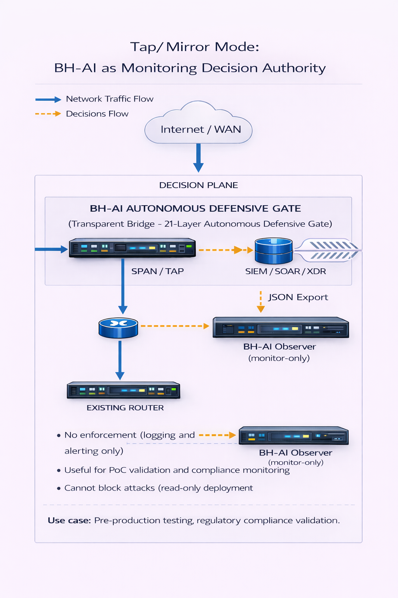
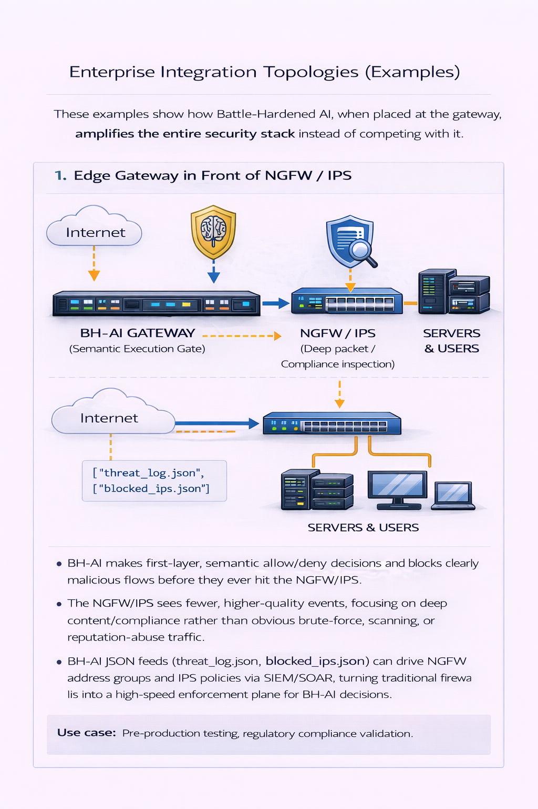
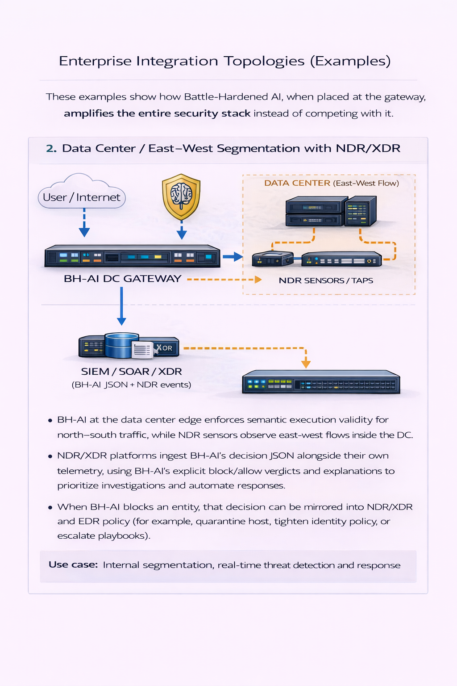
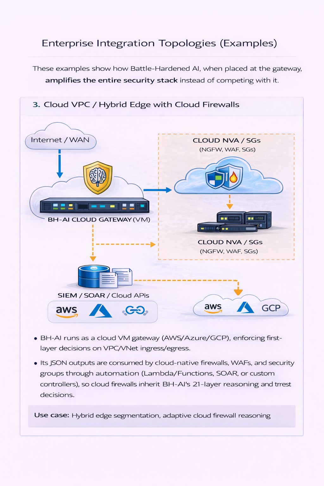
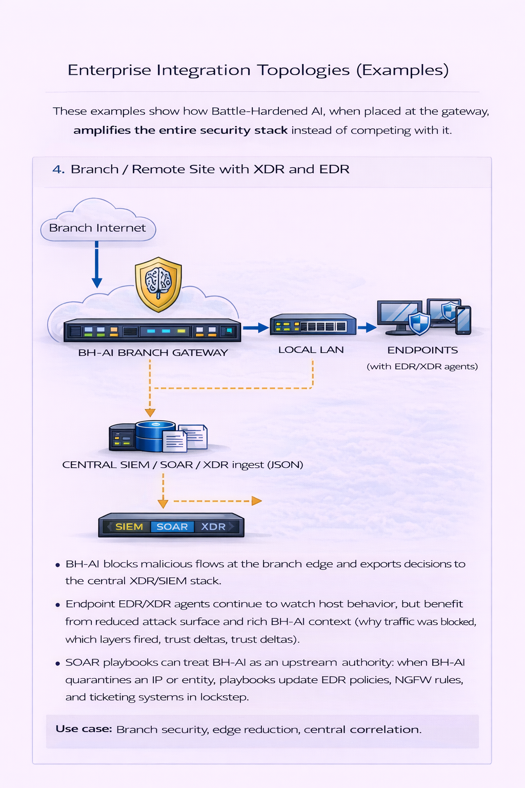

# Battle-Hardened AI
### The Details Here Are Proven

This document is written for people who understand first-layer enforcement, gateways, and control planes. It assumes familiarity with firewalls, routing, kernel telemetry, and pre-execution decision systems.

Nothing in Battle-Hardened AI is designed as a marketing gimmick: every term (21 layers, semantic execution-denial, trust graph, causal inference) corresponds to concrete modules, code paths, and enforcement points that can be inspected in this repository and its documentation. For a formal mapping from claims to code and runtime behavior, see Filepurpose.md and Architecture_enhancements.md.

---

### 🔑 Summary Highlights

- Blocks malicious actions **before execution** using a 21-layer AI ensemble and a final semantic execution-denial gate.
- Acts as a **first-layer firewall commander** for gateways and routers, deciding what should be blocked while delegating actual enforcement to the local firewall control plane.
- Works **without agents**, exporting neutral JSON that plugs into existing SIEM, SOAR, firewall, and XDR stacks.
- Provides documented coverage for **43 MITRE ATT&CK techniques** via pre-execution denial and trust degradation.
- Built for **enterprise, government, and national-security** defense use cases where autonomy, auditability, and privacy are mandatory.
- Optionally connects to a **central relay/VPS** where many Battle-Hardened AI nodes share only sanitized attack patterns and receive model/signature updates,
  so global learning improves over time without any customer content or PII leaving local infrastructure.
- Implements **5 production-ready ML pipeline hardening features** (see *Architecture Enhancements: ML Pipeline Hardening Layer* below for details).

### Privacy-Preserving Defensive Mesh (At a Glance)

- **One server protects an entire network segment** (no endpoint agents required).
- **Every attack makes the system smarter** (automated signature extraction + ML retraining).
- **Every node benefits from global learning** (relay-shared intelligence from worldwide attacks).
- **Organizations retain full control** (relay participation is optional, all data anonymized).
- **Privacy is preserved** (no raw payloads, no PII, only statistical features shared).

### Executive Summary (Non-Technical)

- **Stop breaches before they start:** Battle-Hardened AI sits at the gateway and decides what is allowed to execute, blocking malicious activity before it reaches servers, endpoints, or data.
- **Reduce analyst load, not add to it:** It runs autonomously with explainable decisions and conservative defaults, cutting noise instead of generating more alerts.
- **Integrate with what you already have:** Decisions are exported as simple JSON and enforced through existing firewalls and automation layers. SIEM/SOAR and XDR/EDR consume BH-AI JSON as visibility and workflow inputs; they do not sit on the primary enforcement path.
- **Protect privacy and sovereignty:** Detection happens on your infrastructure, and when the optional relay to the central VPS is enabled, only anonymized
   patterns and statistics are shared—no raw payloads, credentials, or customer data.

## Autonomous Execution-Control System

A new category of security engineered to **operate at the first layer - router and gateway boundary**, where it functions as an upstream execution-control authority rather than a downstream detection engine. Positioned at the network ingress and egress edge, **it evaluates interactions before they acquire operational meaning**, issuing deterministic allow or deny decisions prior to engagement with firewalls, NGFWs, IDS/IPS, or endpoint tools.

Instead of relying solely on signatures or reactive alerts, it performs **pre-execution decisioning with full contextual awareness**—correlating semantic intent, behavioral patterns, temporal sequencing, environmental state, and causal relationships across observed entities. This enables it to assess not only what is occurring, but why it is occurring and whether the interaction is logically valid within the system’s defined execution model.

By acting at this first control layer, it reduces attack surface exposure, suppresses malicious state transitions before propagation, and supplies structured decision outputs that downstream security systems can enforce, correlate, and audit. The result is a unified decision plane that precedes and strengthens the existing security stack rather than competing with it.

We are not aware of any publicly documented enterprise-grade system that:

- Operates as a first-layer gateway authority
- Performs semantic execution validation
- Maintains persistent trust memory
- Uses causal inference to command routers and firewalls prior to execution


---

## Architecture Understanding

### Core Premise: First-Layer Execution-Control Authority

Battle-Hardened AI operates at the **gateway boundary** as the **decision authority**, making pre-execution determinations about what should be blocked or allowed. It does not handle packets directly—instead, it **commands the local OS firewall** (iptables/ipset/nftables on Linux, Windows Defender Firewall on Windows) and exports vendor-neutral JSON that enterprise firewalls, WAFs, and cloud security groups can consume to enforce its decisions.

This architecture creates a clear separation of concerns:
- **Battle-Hardened AI:** Intelligence, analysis, and decision-making
- **OS Firewall:** Enforcement and packet filtering

### Control-Plane Split: Decision vs Enforcement

```
┌──────────────────────────────────────────────────────────┐
│                    DECISION PLANE                        │
│  Battle-Hardened AI (21 detection layers + semantic gate)│
│  - Analyzes traffic via mirror/tap/inline observation    │
│  - Evaluates trust, causality, semantics                 │
│  - Makes block/allow decisions                           │
│  - Emits JSON decisions to enforcement plane             │
└────────────────────┬─────────────────────────────────────┘
                     │ Commands (JSON + firewall API)
                     ↓
┌──────────────────────────────────────────────────────────┐
│                   ENFORCEMENT PLANE                      │
│  OS Firewall / Enterprise Controls                       │
│  (iptables/ipset/nftables, Windows Defender Firewall,    │
│   and external NGFW/WAF/cloud firewalls via JSON)        │
│  - Receive IP/block decisions and policy updates         │
│  - Apply rules at kernel or platform level               │
│  - Drop packets, terminate connections, or adjust paths  │
│  - No analysis—purely enforcement                        │
└──────────────────────────────────────────────────────────┘
```

**This ensures:**
- Battle-Hardened AI cannot be bypassed by routing changes (firewall enforces at kernel)
- Firewall remains auditable and controllable by operators

### How BH-AI Enhances Existing Security Controls

Battle-Hardened AI’s Linux and Windows deployments act as a **semantic decision engine in front of the existing stack**, not a replacement. Its JSON outputs (for example, `threat_log.json` and `blocked_ips.json`) and local OS firewall control are designed to amplify:

- **Network firewalls and cloud controls** – NGFW, WAF, and cloud security groups/NVAs inherit BH-AI allow/block decisions via dynamic address objects, tags, or automation, so packet-level enforcement (including NAT and segmentation) reflects the 21-layer semantic verdicts.
- **Detection and response platforms** – IDS/IPS, NDR, XDR, and EDR ingest BH-AI decisions as high-signal events, enriching detections, tightening containment policies, and aligning host- and network-level responses around a shared trust score.
- **SIEM and SOAR tooling** – SIEMs correlate BH-AI events with logs from other sensors, while SOAR playbooks (when present) can use its explainable verdicts to drive coordinated changes across NGFW/WAF, XDR/EDR, VPN, ZTNA, and NAC policies as a **secondary, export-only integration plane**.
- **Access and edge controls** – VPN concentrators, ZTNA controllers, and NAC platforms can consume BH-AI trust outputs to adapt access (tighten posture checks, quarantine segments, or force re-authentication) when semantic risk increases.
- **Application gateways and traffic managers** – API gateways, reverse proxies, and load balancers can route suspicious flows toward honeypots, throttling, or deeper inspection based on BH-AI’s verdicts, reducing exposure for critical backends.
- **GRC, ITSM, and audit workflows** – Ticketing, GRC, and audit systems can treat BH-AI block decisions as structured, explainable evidence, linking individual enforcement actions (on Linux iptables/ipset/nftables or Windows Defender Firewall) to cases, approvals, and runbooks.
- Integration with SIEM/SOAR happens via JSON export, not enforcement path

### Deployment Roles

Battle-Hardened AI supports three primary deployment roles (Gateway/Router, Host-only, Observer) that define protection scope and enforcement method. In practice, **Gateway/Router on Linux is the primary enterprise-grade profile**; Host-only is used for appliance-style nodes or critical servers, and Observer is for PoC, compliance, or ultra-sensitive environments where you want detection without inline changes. Windows is supported only for host-only or appliance-style deployments; for full network gateway protection, Linux is required.

For the canonical table, environment mapping, and installation links, see [Deployment Scope — Three Roles, Many Environments](#deployment-scope--three-roles-many-environments) below.

#### Deployment Scope — Three Roles, Many Environments

**Battle-Hardened AI operates in 3 deployment roles:**

| Deployment Role | Protection Scope | Enforcement Method |
|----------------|------------------|-------------------|
| **Gateway/Router** | Entire network segment (all devices behind gateway) | Direct firewall commands (iptables/nftables on Linux) |
| **Host-only** | Single machine + services it terminates | Local firewall (iptables on Linux, Windows Defender Firewall) |
| **Observer** | Detection-only (no direct enforcement) | Exports decisions to external firewall via JSON feeds |

**Installation reference:** For setup by deployment role, see the Installation.md sections for Deployment Role, Gateway Pre-Flight Checklist, Linux Gateway Setup, and Cloud Gateway Setup.

**Cloud deployment:** Works identically on cloud VMs (AWS/Azure/GCP) with virtual NICs. Physical hardware not required.

**These 3 roles adapt to different environments:**

- **🏠 Home & Small Office:** Gateway protects entire LAN; host-only protects individual Windows/macOS machines
- **🏢 Enterprise Networks:** Gateway at LAN/VLAN/VPN edge; observer via SPAN/mirror for SOC visibility without routing changes
- **🖥 Servers & Data Centers:** Gateway on reverse proxies/appliance nodes; host-only on critical servers
- **🌐 Websites & APIs:** Gateway in front of web servers/API gateways (works alongside WAFs, not replacing them)
- **☁️ Cloud (IaaS/PaaS):** Gateway with virtual NICs (AWS ENIs, Azure vNICs, GCP interfaces); observer via VPC/VNet flow logs
- **🏭 OT & Critical Infrastructure:** Observer mode for non-intrusive ICS/SCADA/lab monitoring (no agents on sensitive equipment)
- **⚖️ Government & Defense:** Gateway for classified networks with strict data sovereignty (air-gapped relay option available)

#### Enforcement Requires Firewall Integration

To make deny decisions real, Battle-Hardened AI must be connected to the underlying firewall. On Linux, this typically involves `ipset`/`iptables`; on Windows, it wires into Windows Defender Firewall via PowerShell.

#### Hardware Deployment Checklists

These checklists describe hardware setups for gateway and inline bridge roles. Linux is the primary OS for routing and enforcement. Windows is supported for host-only or appliance-style deployments.

##### ✅ Option A — Battle-Hardened AI as Edge Gateway Router (Recommended for Full Control)

**Required Hardware**

- Modem/ONT in bridge mode (disables NAT and firewall)
- Dedicated Linux appliance (2 NICs: WAN + LAN)
- Intel-class NICs (for example, i210/i350)
- AES-NI capable CPU
- 16–32 GB RAM
- SSD/NVMe storage
- Layer-2 switch (VLAN-capable preferred)
- Wi‑Fi AP in bridge mode (no DHCP/NAT)

**What This Delivers**

- Battle-Hardened AI becomes the default gateway
- All traffic flows through Battle-Hardened AI (no bypass without physical change)
- Full control over NAT, routing, firewall, and semantic validation
  
**Topology Mapping:** This hardware profile implements the **Router Mode (Production Default)** topology described in the *Topologies* section below.

##### ✅ Option B — Battle-Hardened AI as Transparent Inline Bridge (No Routing Changes)

**Required Hardware**

- Modem/ONT in bridge mode
- Battle-Hardened AI Linux node with 2 NICs (WAN-side + LAN-side)
- Existing router handling NAT, DHCP, and Wi‑Fi

**What This Delivers**

- No router reconfiguration needed
- Battle-Hardened AI still sees and filters traffic before router interaction
- Minimal architectural disruption

**Topology Mapping:** This hardware profile implements the **Transparent Bridge Mode** topology described in the *Topologies* section below.

#### ⚠️ What You Don’t Need

- ❌ SD-WAN or cloud-managed routers
- ❌ Proprietary routers or expensive chassis
- ❌ Agents on endpoints
- ❌ Cloud connectivity for core detection

### Topologies

#### Router Mode (Production Default)

Battle-Hardened AI VM acts as the **default gateway** for protected systems:

```
Internet ──→ BH-AI Gateway ──→ Protected Systems
              (Decision +         (receive only
              Enforcement)         pre-approved traffic)
```


- Protected systems route all traffic through BH-AI
- BH-AI inspects traffic and commands firewall
- Attackers blocked before reaching protected services

**Setup:** See the Installation.md Gateway/Router Mode section.

#### Transparent Bridge Mode (Planned)

BH-AI operates inline **without becoming the default gateway**:

```
Internet ──→ BH-AI Bridge ──→ Router ──→ Protected Systems
              (transparent        (existing gateway)
               inspection)
```


- No routing changes required
- BH-AI inspects traffic via bridge interface
- Commands firewall on bridge to drop malicious packets

**Status:** Coming soon. See Installation.md for updates.

#### Tap/Mirror Mode (Observer Only)

BH-AI receives copy of traffic via **SPAN port or network TAP**:

```
Internet ──→ Router ──→ Protected Systems
               │
               └──→ SPAN/TAP ──→ BH-AI Observer
                                  (monitor-only)
```


- No enforcement (logging and alerting only)
- Useful for PoC validation and compliance monitoring
- Cannot block attacks (read-only deployment)

**Use case:** Pre-production testing, regulatory compliance validation.

#### Enterprise Integration Topologies (Examples)

These examples show how Battle-Hardened AI, when placed at the gateway, **amplifies the entire security stack** instead of competing with it.

**1. Edge Gateway in Front of NGFW / IPS**

```
Internet ──→ BH-AI Gateway ──→ NGFW / IPS ──→ Core Switch / VLANs ──→ Servers & Users
              (Semantic           (Deep packet /               
              execution gate)      compliance inspection)
```


- BH-AI makes first-layer, semantic allow/deny decisions and blocks clearly malicious flows before they ever hit the NGFW/IPS.
- The NGFW/IPS sees **fewer, higher-quality events**, focusing on deep content/compliance rather than obvious brute-force, scanning, or reputation-abuse traffic.
- BH-AI JSON feeds (threat_log.json, blocked_ips.json) can drive NGFW address groups and IPS policies via SIEM/SOAR or other automation, turning traditional firewalls into a high-speed enforcement plane for BH-AI decisions **without making SIEM/SOAR part of the primary block/allow path**.

**2. Data Center / East–West Segmentation with NDR/XDR**

```
User / Internet ──→ BH-AI DC Gateway ──→ App / DB Tiers
                          │                    │
                          │                    └──→ NDR sensors / taps
                          └──→ SIEM / SOAR / XDR (BH-AI JSON + NDR events)
```


- BH-AI at the data center edge enforces semantic execution validity for north–south traffic, while NDR sensors observe east–west flows inside the DC.
- NDR/XDR platforms ingest BH-AI’s decision JSON alongside their own telemetry, using BH-AI’s **explicit block/allow verdicts and explanations** to prioritize investigations and automate responses.
- When BH-AI blocks an entity, that decision can be mirrored into NDR/XDR and EDR policy (for example, quarantine host, tighten identity policy, or escalate playbooks).

**3. Cloud VPC / Hybrid Edge with Cloud Firewalls**

```
Internet / WAN ──→ BH-AI Cloud Gateway (VM) ──→ Cloud NVA / SGs ──→ Workloads
                         │                         (NGFW, WAF, SGs)
                         └──→ SIEM/SOAR / Cloud APIs
```


- BH-AI runs as a cloud VM gateway (AWS/Azure/GCP), enforcing first-layer decisions on VPC/VNet ingress/egress.
- Its JSON outputs are consumed by cloud-native firewalls, WAFs, and security groups through automation (Lambda/Functions, SOAR, or custom controllers), so **cloud firewalls inherit BH-AI’s 21-layer reasoning and trust decisions**.

**4. Branch / Remote Site with XDR and EDR**

```
Branch Internet ──→ BH-AI Branch Gateway ──→ Local LAN ──→ Endpoints (with EDR/XDR agents)
                                  │
                                  └──→ Central SIEM / SOAR / XDR ingest (JSON)
```


- BH-AI blocks malicious flows at the branch edge and exports decisions to the central XDR/SIEM stack.
- Endpoint EDR/XDR agents continue to watch host behavior, but benefit from **reduced attack surface and rich BH-AI context** (why traffic was blocked, which layers fired, trust deltas).
- SOAR playbooks (where deployed) can treat BH-AI as an upstream authority: when BH-AI quarantines an IP or entity, playbooks update EDR policies, NGFW rules, and ticketing systems in lockstep as a **secondary reaction layer**, after BH-AI and the local firewall have already enforced the decision.

**Ecosystem View — BH-AI as the Autonomous Gate**

At a high level, BH-AI sits at the execution gate and exports **vendor-neutral JSON decisions** that other systems consume. For a prose explanation of how each category below is enhanced, see **How BH-AI Enhances Existing Security Controls** in the Architecture Understanding section above.

```text
          Internet / WAN / Users
                   │
                   ▼
        ┌────────────────────────────┐
        │      Battle-Hardened AI    │
        │   (Gateway / Host / TAP)   │
        │  21-layer + Step 21 gate   │
        └───────────┬────────────────┘
            OS firewall enforcement
 (iptables/ipset/nftables, Windows Firewall)
                    │
        JSON decisions & events (export)
   ┌─────────────┼─────────────┬──────────────┬───────────────┐
   ▼             ▼             ▼              ▼
NGFW/WAF &   SIEM / SOAR   XDR / EDR     VPN / ZTNA / NAC
cloud firewalls (dynamic  (correlation,  (policy & access   
address groups, rules)    playbooks)      adjustments)
   ┌─────────────┴─────────────┬──────────────┬───────────────┐
   ▼                           ▼              ▼
API gateways & LB        GRC / audit &   ITSM / ticketing /
tiers (route, throttle,  compliance tools  runbooks (cases,
or send to honeypot)     (evidence,        approvals, change
                          control mapping)  tracking)
```


In enterprise deployments this means:

- **Firewalls / NGFW / WAF / cloud controls** enforce BH-AI block/allow decisions via dynamic address groups, tags, and policies.
- **NDR / IDS / XDR / EDR** gain an upstream semantic verdict and trust score for each entity, improving triage, correlation, and automated containment.
- **SIEM / SOAR** orchestrate changes across all these planes using BH-AI’s explainable JSON events as the trigger and ground truth.
- **VPN, Zero-Trust access, and NAC** can tighten or relax access based on BH-AI trust deltas and recent semantic violations.
- **API gateways, load balancers, and reverse proxies** can route, throttle, or divert suspicious flows (for example to honeypots) based on BH-AI output.
- **GRC, audit, and ticketing systems** consume BH-AI’s audit trails and decisions as evidence and as automatic case-open/close signals.

Taken together, these patterns highlight the intended positioning: **Battle-Hardened AI is an autonomous defensive gate that drives firewalls, IDS/IPS, NDR, XDR, cloud controls, identity and access systems, and operational tooling via a single, explainable decision plane.**

### Federated Relay Architecture

When the **optional relay** is enabled, Battle-Hardened AI nodes share intelligence globally while preserving privacy:

- Customer nodes upload **sanitized patterns and statistics only** (no payloads, credentials, or PII).
- Relay distributes **models, signatures, and reputation feeds only** (no raw training data from customers).
- Model signing, Byzantine validation, and ONNX optimization harden distribution against tampering and performance regressions.

For the full Stage 5–7 technical flow and privacy guarantees, see the AI instructions (Stages 5–7 implementation details) and Attack handling flow (end-to-end relay and response behavior).

### Privacy-Preserving Defensive Mesh (Details)

- **One server protects an entire network segment (no endpoint agents required)** – implemented by the **Gateway/Router** deployment role, where a single Linux node commands the OS firewall for all devices behind it (see [Deployment Scope — Three Roles, Many Environments](#deployment-scope--three-roles-many-environments)).
- **Every attack makes the system smarter (automated signature extraction + ML retraining)** – Stage 5 extracts sanitized signatures, statistics, graph patterns, and reputation into local JSON, and Stage 7/relay retraining fold those into new models and signatures.
- **Every node benefits from global learning (relay-shared intelligence from worldwide attacks)** – when the optional relay is enabled, nodes push only sanitized patterns and pull signed models, signatures, and reputation feeds; no customer training data is shared.
- **Organizations retain full control (relay participation is optional, all data anonymized)** – relay connectivity is opt-in and can be disabled entirely at install or runtime; when enabled, uploads are restricted to anonymized patterns and aggregated statistics.
- **Privacy is preserved (no raw payloads, no PII, only statistical features shared)** – Stage 5 and the relay-side training pipeline are explicitly designed to avoid raw payloads, credentials, and PII; only statistical features, signatures, and anonymized topology are shared.

### Architecture Enhancements: ML Pipeline Hardening Layer

Beyond the 21 detection layers, Battle-Hardened AI implements **5 production security features** that harden the ML training pipeline against supply chain attacks, performance degradation, and adversarial manipulation:

| Enhancement | Security Benefit | Performance Benefit | MITRE Defense |
|-------------|------------------|---------------------|---------------|
| **#1: Model Cryptographic Signing** | Prevents model injection | <1ms overhead | T1574.012 (Supply Chain) |
| **#2: Smart Pattern Filtering** | Reduces attack surface | 70-80% bandwidth savings | N/A (Operational) |
| **#3: Model Performance Monitoring** | Detects model poisoning | ~5% overhead | T1565.001 (Data Manipulation) |
| **#4: Adversarial Training** | ML evasion resistance | Training +30% (relay-side only) | T1562.004 (Impair Defenses) |
| **#5: ONNX Model Format** | Faster threat response | **2-5x faster inference** | N/A (Performance) |

**Key capabilities:**
- Ed25519 cryptographic signatures verify every model before loading
- Bloom filters deduplicate attack patterns (76% bandwidth reduction in production)
- Production accuracy tracking triggers auto-retraining if model degrades
- FGSM adversarial training makes models robust against ML evasion attacks
- ONNX Runtime provides 2-5x faster CPU inference (no GPU required)

**For detailed technical documentation:**
- Architecture_enhancements.md - Complete implementation guide
- ONNX_integration.md - ONNX deployment and benchmarks

### Operational Loop: Continuous Defense Improvement

Battle-Hardened AI runs in a **closed loop** so defenses continuously adapt to new behavior:

1. **Detect** – 21 layers analyze traffic (signatures, ML, behavioral, trust, causal).
2. **Decide** – Ensemble voting + semantic gate + trust modulation produce allow/deny.
3. **Enforce** – OS firewalls apply blocks/TTL; connections are dropped or rate-limited.
4. **Log & Export** – Decisions written to JSON (threat_log.json, blocked_ips.json, audit) and streamed to the dashboard and (optionally) SIEM/SOAR.
5. **Learn & Measure** – Extract sanitized patterns, update reputation, monitor model performance, and validate integrity.
6. **Update** – Merge new signatures, refresh models, and adjust baselines, then loop back to Detect with stronger defenses.

Feedback operates on multiple time scales (real-time reputation and firewall updates; hourly signature extraction; 6‑hour model pulls from relay; weekly retraining; monthly drift refresh; emergency retraining when accuracy drops), all while keeping raw payloads and customer data local.

For the full Stage 7 implementation and timing details, see the deep-dive architecture docs in the architecture documentation folder.