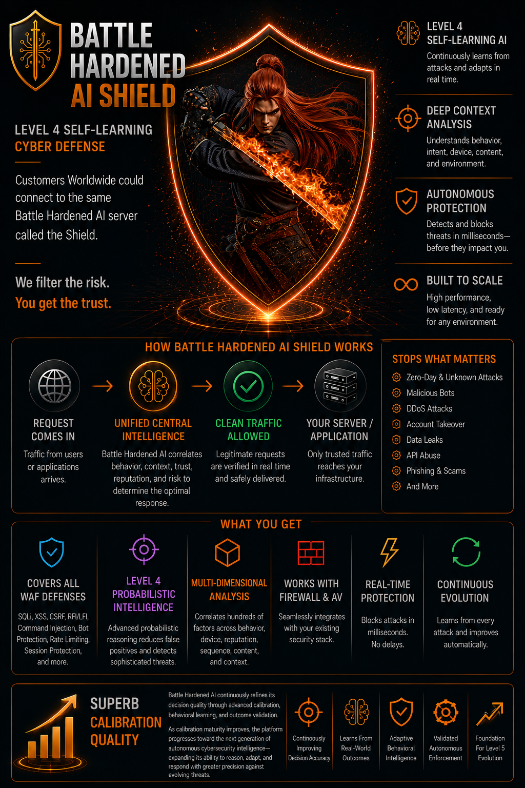
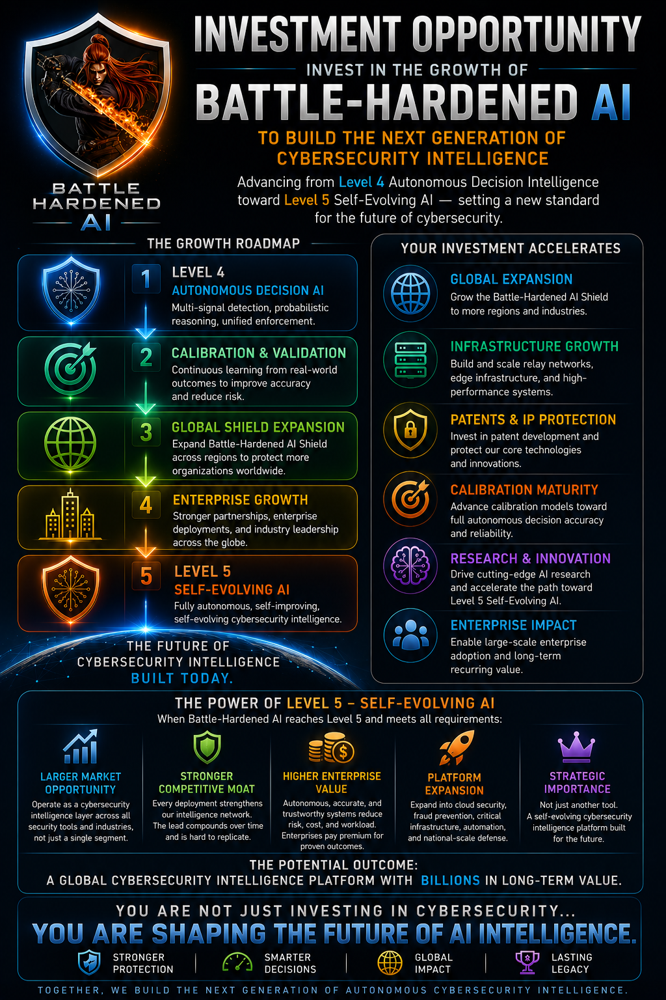

# Battle-Hardened AI

Battle-Hardened AI is a centralized decision intelligence system that evaluates every interaction **before execution**.

It consolidates 32 detection signals into a unified decision pipeline, producing a single, consistent, and authoritative outcome — enforced simultaneously across 12 infrastructure backends.

Instead of relying on static rules or fragmented tools, it analyzes attacker behavior across multiple layers and adapts through continuous learning, probabilistic reasoning, and calibrated decision-making.

The system operates at **Level 4 — Autonomous Decision AI** — autonomously computing, validating, calibrating, and enforcing probabilistic security decisions within a unified reasoning architecture. It learns and recalibrates from observed outcomes while maintaining a controlled and deterministic enforcement model. Six of eight Level 5 criteria are now met — self-governance, autonomous strategy adaptation, autonomous calibration refinement, self-evolving decision models, bounded autonomous authority, and improvement without manual rule creation are all operational. The system is actively advancing through the remaining two Level 5 requirements.

---

| Cybersecurity AI Levels          | Examples                                                                                 |
| -------------------------------- | ---------------------------------------------------------------------------------------- |
| Level 1 — Reactive AI            | Snort, Suricata, ModSecurity, OSSEC                                                      |
| Level 2 — Context-Aware AI       | Cloudflare WAF, AWS WAF, Azure WAF, Imperva WAF                                          |
| Level 3 — Adaptive Learning AI   | Microsoft Defender XDR, CrowdStrike Falcon, Darktrace, SentinelOne, Palo Alto Cortex XDR |
| Level 4 — Autonomous Decision AI | Battle-Hardened AI, Battle Offensive AI                                                  |
| Level 5 — Self-Evolving AI       | *(next frontier — in active development)*                                                |

---

## Classification Framework

No international standards body — NIST, ISO, MITRE, or otherwise — has yet published a formal classification for autonomous decision AI in cybersecurity. The Level 1–5 taxonomy above is Battle-Hardened AI's own framework, developed to describe the qualitative leap between reactive, adaptive, and truly autonomous security systems.

Battle-Hardened AI is among the first cybersecurity systems on earth to operate at Level 4 — making fully autonomous, probabilistic enforcement decisions without human intervention, continuously learning from real-world outcomes, and self-calibrating its decision model against validated statistical thresholds. The tools placed at Levels 1–3 are established, publicly documented products; their placement reflects capability boundaries observable from public documentation and behaviour, not formal certification.

The absence of an official external standard is not a gap in the system — it is a reflection of where the frontier currently sits. Independent verification of Level 4 operation is available directly from the running system: Section 20 diagnostic probes, comprehensive audit logs, calibration quality metrics, and MITRE ATT\&CK coverage documentation are all accessible for operator and investor review.

---

> Engineered to detect, reason, and enforce against advanced and zero-day attack patterns — including threats that have never been seen before.

| Traditional Security        | ⚔️ Battle-Hardened AI        |
| --------------------------- | ----------------------------- |
| Rules                       | Reasoning                     |
| Static                      | Adaptive                      |
| Stateless                   | Stateful                      |
| Fragmented                  | Unified                       |
| Heuristics                  | Probabilistic Decisions       |
| Alert                       | Enforce                       |
| Isolated tools              | Federated intelligence        |
| Manual tuning               | Self-calibrating              |
| Single backend              | 12 enforcement backends       |
| Fixed thresholds            | Continuously recalibrated     |
| One-sided learning          | Bidirectional outcome learning |
| Passive to tampering        | Self-defending with automatic containment |

---


---

## Why Battle-Hardened AI Matters

Cybersecurity tools generate alerts.

Battle-Hardened AI generates decisions.

Most platforms detect threats.

Battle-Hardened AI reasons about them.

Most platforms require human interpretation.

Battle-Hardened AI computes, validates, calibrates, and enforces decisions autonomously.

The result is faster response, reduced operational burden, and stronger protection against modern threats.

---

## True Purpose

Modern threats change behavior, distribute across sessions, and evade signature-based detection. Traditional defenses — built on predefined patterns and static rules — are not designed to handle this in real time.

Battle-Hardened AI closes that gap. It introduces adaptive, multi-signal detection that reasons about attacker behavior, learns from real-world outcomes, and enforces decisions with:

* deterministic enforcement
* low latency
* full auditability
* local and controlled operation

Existing enterprise security tools continue doing what they do well. Battle-Hardened AI handles what they were never built to solve.

Battle-Hardened AI enforces decisions directly across all major infrastructure backends simultaneously:

| Enforcement Target    | Examples                                                            |
| --------------------- | ------------------------------------------------------------------- |
| Network firewalls     | nftables, iptables, UFW, firewalld, CSF, VyOS, OpenWRT, Alpine     |
| Cloud security groups | AWS NACL, Azure NSG, GCP VPC Firewall, Huawei Security Groups       |
| Web application layer | Dynamic WAF rule injection and application-layer blocking           |
| XDR / EDR             | Endpoint detection and response integration                         |
| SIEM / SOAR           | Splunk, Microsoft Sentinel, PagerDuty, automated response workflows |
| Deception systems     | Adaptive honeypot redirect and fake service routing                 |

A single decision propagates simultaneously to all configured enforcement targets — without manual intervention or tool fragmentation.

---

## Deployment

Battle-Hardened AI is available in two deployment models.

---

**Battle-Hardened AI Shield** is the primary offering — cloud-delivered, zero-install protection. Organizations point their domain at the Shield via a DNS change. Detection, behavioral analysis, and autonomous enforcement occur in the cloud before traffic ever reaches the customer environment. No software to install, no infrastructure to manage, no operational overhead.

```
Internet
    ↓
Battle-Hardened AI Shield        ←  probabilistic decision intelligence
    ↓
Customer Infrastructure
```



---

**Battle-Hardened AI Private** is for organizations that require on-premises deployment. Battle-Hardened AI is installed within the customer environment and sits as the intelligent decision layer between the perimeter and protected infrastructure — traffic never leaves.

```
Internet
    ↓
WAF / CDN / DDoS Mitigation      ←  perimeter filtering (known signatures, rate limits)
    ↓
Battle-Hardened AI               ←  probabilistic decision intelligence
    ↓
Web Servers · APIs · Databases
Internal Networks · Cloud VMs
```

Enforcement spans Layer 3 (Network), Layer 4 (Transport), and Layer 7 (Application). The WAF handles high-volume filtering of known signatures — Battle-Hardened AI processes what survives, detecting novel, adaptive, and evasive attacks that signature-based systems cannot classify. It feeds intelligence back into the WAF and all other enforcement backends, making every layer progressively smarter over time.

---

Both Shield and Private nodes maintain a silent background connection to the Battle-Hardened AI Relay Network, continuously synchronizing threat intelligence, model updates, and calibration data across the global fleet. What one node learns, all nodes benefit from.

---

## Business Value

Organizations deploy Battle-Hardened AI to reduce response times, improve security coverage, reduce analyst workload, and strengthen protection against threats that evade traditional signature-based defenses. The platform acts as a centralized decision intelligence layer, allowing existing security investments to operate more effectively.

---

## Three-Tier Detection Architecture

Battle-Hardened AI uses three complementary detection tiers that operate simultaneously and feed into a unified decision engine:

| Tier                               | Approach                                                                               |
| ---------------------------------- | -------------------------------------------------------------------------------------- |
| Tier 1 — Anomaly Detection         | Unsupervised and sequence models — detects behavioral deviation from learned baselines |
| Tier 2 — Supervised Classification | Federated and calibrated — trained on globally synchronized threat intelligence        |
| Tier 3 — Signal Fusion             | 32-signal probabilistic fusion across a 44-dimensional feature vector                  |

The three tiers are architecturally independent. Final enforcement decisions are produced only after all three tiers contribute to the probabilistic fusion. No single model failure can disable detection.

The system maps detection coverage against **52 MITRE ATT&CK techniques** across 14 tactic categories: Reconnaissance, Resource Development, Initial Access, Execution, Persistence, Privilege Escalation, Defense Evasion, Credential Access, Discovery, Lateral Movement, Collection, Command & Control, Exfiltration, and Impact.

---

## Federated Intelligence

All model updates distributed through the relay network are **cryptographically signed (Ed25519)**, ensuring tamper-proof delivery. A six-layer adversarial defense stack rejects poisoned or adversarial contributions across both the data space and gradient space before they can influence local decision-making — the fleet cannot be weaponized against itself. Locally-trained models are signed with the same Ed25519 infrastructure used for relay-distributed models, and any file-level tampering with the decision core triggers automatic containment via the kill-switch within seconds.

Locally, over 28,000 threat signatures are maintained and continuously refined, supplemented by globally aggregated patterns from every connected node. New signatures are only distributed after outcome confirmation — false-positive patterns cannot propagate fleet-wide.

---

## Calibration Model

All probabilistic decisions pass through a three-stage calibration lifecycle before autonomous enforcement is permitted:

| Stage       | Behaviour                                                                                   |
| ----------- | ------------------------------------------------------------------------------------------- |
| SHADOW      | Decisions are computed and logged but not enforced. Calibration data is collected silently. |
| ASSIST      | Decisions are enforced with operator awareness. Calibration is actively improving.          |
| ENFORCEMENT | Full autonomous enforcement. Calibration has met validated quality thresholds.              |

The system cannot advance to autonomous enforcement until calibration quality is statistically validated (Brier score ≤ 0.18, ECE ≤ 0.05) across a representative and diverse dataset — not just high-volume data. Quality is verified continuously against live false-positive rates, not once at deployment.

The learning loop is fully bidirectional: all eight enforcement outcome paths — including honeypot engagements, SOAR playbook completions, human appeals, and false-positive corrections — write labeled training rows. The model learns both what attackers look like and what legitimate traffic looks like when it appears suspicious.

---

## Step 21 Semantic Gate

Before any enforcement action is executed, the decision passes through a **semantic execution-denial gate** — an internal constitutional constraint that evaluates whether the proposed action is proportional, contextually valid, and within policy bounds.

No enforcement action — regardless of model confidence or signal strength — bypasses the semantic gate. It is the final authority before any action reaches infrastructure.

---

## Advanced Self-Diagnostics

Battle-Hardened AI includes an end-to-end self-diagnostic system that validates the entire system at runtime — not just individual components.

**80 health probes** execute continuously across every subsystem, including:

* ML model integrity and calibration state
* Signal collection pipeline health
* Enforcement backend connectivity and response
* Relay synchronization status and signature verification
* Cryptographic signing chain integrity
* Network telemetry collection and processing
* Firewall rule application and confirmation

This is a live system correctness validator — verifying actual runtime behavior under real conditions, not just code validity.

---

## Twin Brothers - Battle Offensive AI

Battle Offensive AI is the offensive counterpart to Battle-Hardened AI and remains private and non-commercial.

---

## Qualification Checklist

Battle-Hardened AI has completed its Level 4 self-learning calibration requirements and meets six of eight Level 5 criteria. Ongoing development targets the remaining two Level 5 requirements.

| Status | Meaning |
| ------ | ------- |
| ✅ | Implemented and live |
| ⬜ | Pending / target |

---

### Level 4 — Core Qualification

| Status | Requirement |
| ------ | ----------- |
| ✅ | Multi-signal decision intelligence |
| ✅ | Probabilistic reasoning and confidence scoring |
| ✅ | Continuous calibration, false-positive reduction, and outcome learning |
| ✅ | Autonomous decision-making with bounded controls |
| ✅ | Behavioral and sequence-based detection |
| ✅ | Unified enforcement across multiple backends |
| ✅ | Explainable decisions |
| ✅ | Runtime self-diagnostics |
| ✅ | Trust, reputation, and contextual risk evaluation |
| ✅ | Stable production operation |

---

### Battle-Hardened AI Shield — Cloud Requirements

| Status | Requirement |
| ------ | ----------- |
| ✅ | Shared threat intelligence across tenants |
| ✅ | Secure relay synchronization |
| ✅ | Tenant isolation |
| ✅ | Tenant-aware trust and reputation scoring |
| ✅ | Tenant-scoped enforcement |
| ✅ | Global threat promotion logic |

---

### Level 5 — Target Criteria

| Status | Requirement |
| ------ | ----------- |
| ✅ | Self-governance |
| ⬜ | Recursive optimization |
| ✅ | Autonomous strategy adaptation |
| ✅ | Autonomous calibration refinement |
| ⬜ | Cross-domain reasoning |
| ✅ | Self-evolving decision models |
| ✅ | Bounded autonomous authority |
| ✅ | Improvement without manual rule creation |

---

# Investor Details



---

This public overview is intentionally high level and omits internal design details, algorithms, and file-level implementation to preserve intellectual property and support ongoing patent activities.

Contact: Yuhisern@protonmail.com


