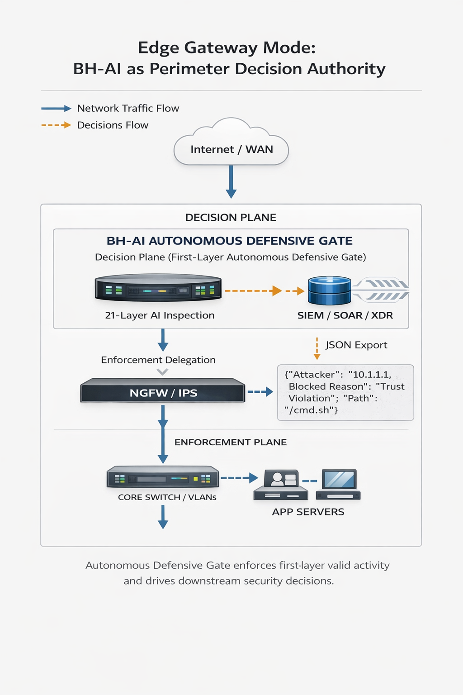
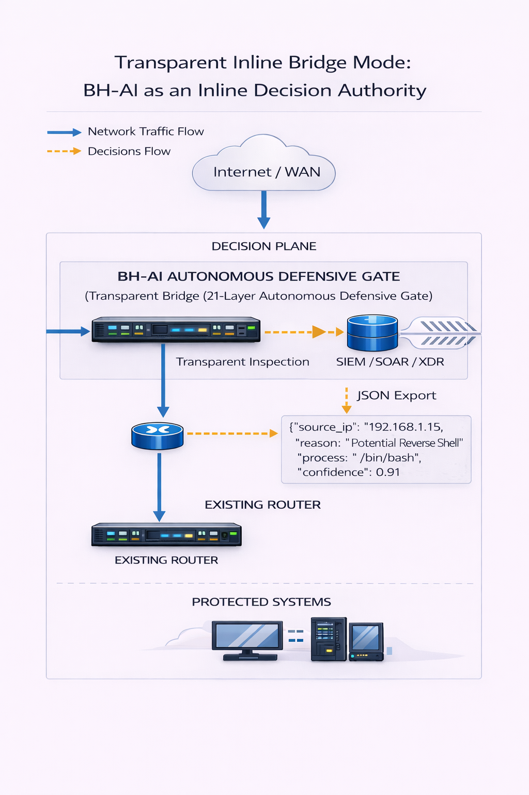
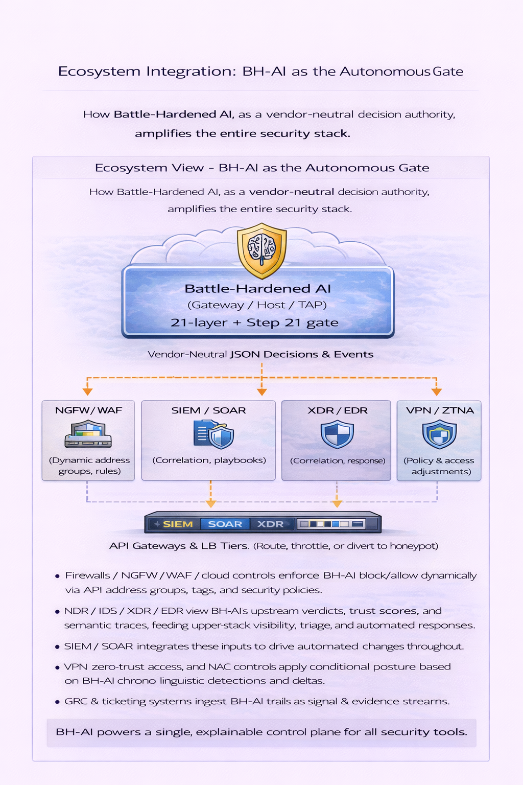

This project is owned by Cyber Quote (Singapore) and is being prepared for worldwide patent protection.

Battle Hardened AI is the ultimate defensive version; for the offensive version — its twin brother, Battle Offensive AI - it does the full penetration test better than humans (not available to the public).

---

# Battle-Hardened AI

Battle Hardened AI is a centralized decision intelligence system that evaluates every interaction before execution.

It unifies 22 detection signals into a single decision pipeline, producing one consistent and authoritative outcome.

Instead of relying on static rules or isolated tools, it understands attacker behavior across layers and continuously adapts through real-time learning.

This system — Self-Evolving Intelligence - Continuously learns, adapts, recalibrates decisions, and optimizes itself from outcomes.

Future upgrade - Meta Intelligence.

> Engineered to detect and adapt against advanced and zero-day attack patterns.

| Traditional Security | ⚔️ Battle-Hardened AI    |
|---------------------|--------------------------|
| Rules               | Reasoning                |
| Static              | Adaptive                 |
| Stateless           | Stateful                 |
| Fragmented          | Unified                  |
| Heuristics          | Probabilistic Decisions  |

---

## True Purpose

Battle-Hardened AI is not a replacement for enterprise security systems — it is an extension.

Traditional defenses are designed for stability, predictability, and known threats. They perform well against predefined patterns but have limited capability when dealing with adaptive, evolving attacks.

Modern cyber threats do not remain static. They change behavior, distribute across sessions, and evade signature-based detection. This creates a gap that traditional systems are not designed to handle in real time.

Battle-Hardened AI addresses this gap by introducing adaptive, multi-signal detection that learns from real-world outcomes, while maintaining:

* deterministic enforcement
* low latency
* full auditability
* no dependency on external decision systems

All real-time decisions remain local and controlled.

This is not about replacing what works.

It is about extending existing defenses to handle threats they were never designed to solve.

---

## What “First Layer” Means

The term “layer” has two meanings in security, and both apply differently to Battle-Hardened AI:

OSI Network Model (technical layers)
The OSI model defines 7 networking layers, from physical hardware (Layer 1) to applications (Layer 7).

Battle-Hardened AI operates across:

Layer 3 (Network) — IP-based control and routing decisions
Layer 4 (Transport) — connection handling and port-level enforcement
Layer 7 (Application) — semantic analysis and behavioral intelligence

It does not operate at OSI Layer 1 (physical hardware).

Security Architecture Model (defense layers)
In security architecture, “layers” describe the position within a defense stack.

Layer 1 — Perimeter / gateway (first point of control)
Layer 2 — Internal monitoring and telemetry
Layer 3 — Detection and analysis systems
Layer 4 — Response and automation

> Battle-Hardened AI operates as Security Architecture Layer 1 — the perimeter authority that evaluates and controls interactions before they reach downstream systems — while enforcing decisions across OSI Layers 3, 4, and 7.

---

## Advance Self-Diagnostics

Existing Code review tools focus on improving individual pieces of code. They identify bugs, security issues, and suggest better coding practices, typically at the file or pull-request level.

Battle Hardened AI operates at a completely different level. It validates the entire system end-to-end, ensuring that structure, logic, and runtime behavior are all correct. It does not just improve code — it verifies that the system behaves correctly under real conditions.

In simple terms: traditional tools help developers write better code, while Battle Hardened AI ensures the whole system is actually correct, enforced, and trustworthy.

---

## Example Topologies

Below are illustrative examples of how Battle-Hardened AI can be deployed within a network. These diagrams are conceptual and do not expose internal implementation details.

**Edge Gateway (Recommended Pattern)**

Battle-Hardened AI operates as the default gateway for protected systems, evaluating and enforcing decisions on all traffic before it reaches internal networks.

**Transparent Inline / Bridge**

Battle-Hardened AI is deployed inline, inspecting and controlling traffic flows without requiring major routing changes.

**Ecosystem View**

Battle-Hardened AI functions as a unified decision authority, orchestrating enforcement across network firewalls (L3/L4), web application firewalls (L7), cloud security groups, XDR/EDR platforms, SIEM/SOAR systems, VPN/ZTNA controls, API gateways, and GRC/audit frameworks.

A single decision is propagated across all layers of the defense stack within the same enforcement cycle — eliminating manual rule updates, cross-tool inconsistencies, and gaps in protection.

---

This public overview is intentionally high level and omits internal design details, algorithms, and file-level implementation to preserve intellectual property and support ongoing patent activities.
